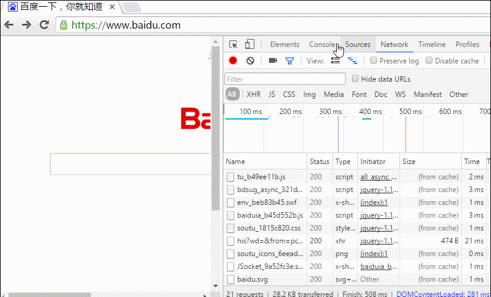
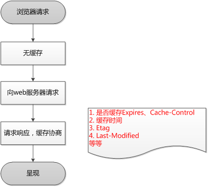
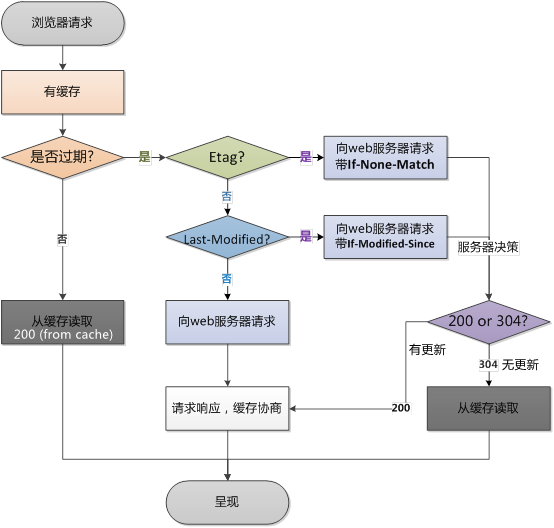

*HTTP相关知识*
<!-- more -->

```html
当资源第一次被访问的时候，HTTP请求头部如下
(Request-Line) GET /a.html HTTP/1.1
Host                127.0.0.1
User-Agent          Mozilla/5.0 (X11; U; Linux i686; zh-CN; rv:1.9.0.15)Gecko/2009102815
Accept              text/html,application/xhtml+xml,application/xml;q=0.9,*/*;q=0.8
Accept-Language     zh-cn,zh;q=0.5
Accept-Encoding     gzip,deflate
Accept-Charset      gb2312,utf-8;q=0.7,;q=0.7
Keep-Alive          300
Connection          keep-alive

HTTP返回响应头部如下
(Status-Line)       HTTP/1.1 200 OK
Date                Thu, 26 Nov 200913:50:54 GMT
Server              Apache/2.2.11 (Unix)PHP/5.2.9
Last-Modified       Thu, 26 Nov 2009 13:50:19 GMT
Etag                “8fb8b-14-4794674acdcc0″
Accept-Ranges       bytes
Content-Length      20
Keep-Alive          timeout=5, max=100
Connection          Keep-Alive
Content-Type        text/html

当资源第一次被访问的时候，http返回200的状态码，并在头部携带上当前资源的一些描述信息，如

Last-Modified       指示最后修改的时间
Etag                指示资源的状态唯一标识
Expires             指示资源在浏览器缓存中的过期时间

接着浏览器会将文件缓存到Cache目录下，并同时保存文件的上述信息

当第二次请求该文件时，浏览器会先检查Cache目录下是否含有该文件，如果有，并且还没到Expires设置的时间，即文件还没有过期，那么此时浏览器将直接从Cache目录中读取文件，而不再发送请求

如果文件此时已经过期，则浏览器会发送一次HTTP请求到WebServer，并在头部携带上当前文件的如下信息

If-Modified-Since   Thu, 26 Nov 2009 13:50:19 GMT
If-None-Match       ”8fb8b-14-4794674acdcc0″

即 把上一次修改的时间，以及上一次请求返回的Etag值一起发送给服务器。服务器在接收到这个请求的时候，先解析Header里头的信息，然后校验该头部信 息。 如果该文件从上次时间到现在都没有过修改或者Etag信息没有变化，则服务端将直接返回一个304的状态，而不再返回文件资源，状态头部如下

(Status-Line)       HTTP/1.1 304 Not Modified
Date                Thu, 26 Nov 200914:09:07 GMT
Server              Apache/2.2.11 (Unix)PHP/5.2.9
Connection          Keep-Alive
Keep-Alive          timeout=5, max=100
Etag                “8fb8b-14-4794674acdcc0″

这样，就能够很大程度上减少网络带宽以及提升用户的浏览器体验。 当然，如果服务器经过匹配发现文件修改过了，就会将文件资源返回，并带上新文件状态信息。
```

## 什么是浏览器缓存

简单来说，浏览器缓存就是把一个已经请求过的Web资源（如html页面，图片，js，数据等）拷贝一份副本储存在浏览器中。缓存会根据进来的请求保存输出内容的副本。当下一个请求来到的时候，如果是相同的URL，缓存会根据缓存机制决定是直接使用副本响应访问请求，还是向源服务器再次发送请求。比较常见的就是浏览器会缓存访问过网站的网页，当再次访问这个URL地址的时候，如果网页没有更新，就不会再次下载网页，而是直接使用本地缓存的网页。只有当网站明确标识资源已经更新，浏览器才会再次下载网页。至于浏览器和网站服务器是如何标识网站页面是否更新的机制，将在后面介绍



上图就是使用了缓存的例子，在页面请求之后，web资源都被缓存了，在后面的重复请求中，可以看到许多资源都是直接从缓存中读取的（from cache），而不是重新去向服务器请求  

## 为什么使用缓存

+ 减少网络带宽消耗 无论对于网站运营者或者用户，带宽都代表着金钱，过多的带宽消耗，只会便宜了网络运营商。当Web缓存副本被使用时，只会产生极小的网络流量，可以有效的降低运营成本

+ 降低服务器压力 给网络资源设定有效期之后，用户可以重复使用本地的缓存，减少对源服务器的请求，间接降低服务器的压力。同时，搜索引擎的爬虫机器人也能根据过期机制降低爬取的频率，也能有效降低服务器的压力

+ 减少网络延迟，加快打开页面 带宽对于个人网站运营者来说是十分重要，而对于大型的互联网公司来说，可能有时因为钱多而真的不在乎。那Web缓存还有作用吗？答案是肯定的，对于最终用户，缓存的使用能够明显加快页面打开速度，达到更好的体验

## 浏览器端的缓存规则

对于浏览器端的缓存来讲，这些规则是在 \*\*HTTP协议头 \*\*和 \*\*HTML页面的Meta标签 \*\*中定义的。他们分别从 新鲜度 和 校验值 两个维度来规定浏览器是否可以直接使用缓存中的副本，还是需要去源服务器获取更新的版本。

+ \*\*新鲜度(过期机制): \*\*也就是缓存副本有效期。一个缓存副本须满足以下条件，浏览器会认为它是有效的，足够新的。满足以下两个情况的一种，浏览器会直接从缓存中获取副本并渲染:

    1. 含有完整的过期时间控制头信息（HTTP协议报头），并且仍在有效期内；

    2. 浏览器已经使用过这个缓存副本，并且在一个会话中已经检查过新鲜度；

+ \*\*校验值(验证机制): \*\*服务器返回资源的时候有时在控制头信息带上这个资源的实体标签Etag（Entity Tag），它可以用来作为浏览器再次请求过程的校验标识。如过发现校验标识不匹配，说明资源已经被修改或过期，浏览器需求重新获取资源内容

## 浏览器缓存的控制

### 使用HTML Meta 标签

Web开发者可以在HTML页面的节点中加入标签，代码如下

```html
<meta http-equiv="Pragma" content="no-cache">  
<!- Pragma是http1.0版本中给客户端设定缓存方式之一，具体作用会在后面详细介绍 -->

常用META的禁用缓存的方法
<META HTTP-EQUIV="Pragma" CONTENT="no-cache">
<META HTTP-EQUIV="Cache-Control" CONTENT="no-cache">
<META HTTP-EQUIV="Expires" CONTENT="0">
```

上述代码的作用是告诉浏览器当前页面不被缓存，每次访问都需要去服务器拉取。但是！这里有个坑...
事实上这种禁用缓存的形式用处很有限：

仅有IE才能识别这段meta标签含义，其它主流浏览器仅识别 "Cache-Control: no-store" 的meta标签
在IE中识别到该meta标签含义，并不一定会在请求字段加上Pragma，但的确会让当前页面每次都发新请求（仅限页面，页面上的资源则不受影响）

### 使用HTTP相关的消息报头

在这里就需要先跟大家介绍一下HTTP的相关知识。一个URI的完整HTTP协议交互过程是由HTTP请求和HTTP响应组成的。有关HTTP详细内容可参考《Hypertext Transfer Protocol — HTTP/1.1》、《HTTP协议详解》等。
在HTTP请求和响应的消息报头中，常见的与缓存有关的消息报头有：

|规则|消息包头|值/示例|类型|作用|
|:--|:--|:--|:--|:--|
|新鲜度|Pragma|no-cache|响应|告诉浏览器忽略资源的缓存副本，每次访问都需要去服务器拉取【http1.0中存在的字段，在http1.1已被抛弃，使用Cache-Control替代，但为了做http协议的向下兼容，很多网站依旧会带上这个字段】
||Expires| Mon, 15 Aug 2021 03:56:47 GMT|响应|启用缓存和定义缓存时间。告诉浏览器资源缓存过期时间，如果还没过该时间点则不发请求【http1.0中存在的字段，该字段所定义的缓存时间是相对服务器上的时间而言的，如果客户端上的时间跟服务器上的时间不一致（特别是用户修改了自己电脑的系统时间），那缓存时间可能就没啥意义了。在HTTP 1.1版开始，使用Cache-Control: max-age=秒替代】|
||Cache-Control|no-cache|响应|告诉浏览器忽略资源的缓存副本，强制每次请求直接发送给服务器，拉取资源，但不是“不缓存”|
|||no-store|响应| 强制缓存在任何情况下都不要保留任何副本|
|||max-age=[秒]|响应|指明缓存副本的有效时长，从请求时间开始到过期时间之间的秒数|
|||public|响应|任何路径的缓存者（本地缓存、代理服务器），可以无条件的缓存改资源比如对于一些非常私密的数据，如果缓存到代理服务器，别人直接访问代理就可以拿到这些数据，是非常危险的，因此对于这些数据一般是不会允许代理服务器进行缓存的，将响应头部的Cache-Control设为private，而不是public。|
|||private|响应|只针对单个用户或者实体（不同用户、窗口）缓存资源|
||Last-Modified|Mon, 15 Aug 2016 03:56:47 GMT|响应|告诉浏览器这个资源最后的修改时间。服务器将资源传递给客户端时，会将资源最后更改的时间以“Last-Modified: GMT”的形式加在实体首部上一起返回给客户端【只能精确到秒级，如果某些文件在1秒钟以内，被修改多次的话，它将不能准确标注文件的修改时间】| 
||If-Modified-Since|Mon, 15 Aug 2016 03:56:47 GMT|请求|其值为上次响应头的Last-Modified值，再次向web服务器请求时带上头If-Modified-Since。web服务器收到请求后发现有头If-Modified-Since则与被请求资源的最后修改时间进行比对。若最后修改时间较新，说明资源又被改动过，则响应整片资源内容（写在响应消息包体内），包括更新Last-Modified的值，HTTP 200；若最后修改时间较旧，说明资源无新修改，则响应HTTP 304(无需包体，节省浏览)，告知浏览器继续使用所保存的cache|
|校验值|ETag|"fd56273325a2114818df4f29a628226d"|响应|告诉浏览器当前资源在服务器的唯一标识符（生成规则由服务器决定
||If-None-Match|"fd56273325a2114818df4f29a628226d"|请求|当资源过期时（使用Cache-Control标识的max-age），发现资源具有Etage声明，则再次向web服务器请求时带上头If-None-Match（Etag的值）。web服务器收到请求后发现有头If-None-Match则与被请求资源的相应校验串进行比对，决定返回200或304缓存控制|
|缓存控制|proxy-revalidate||响应|代理服务器的缓存过期后到源服务器获取|
||must-revalidate||响应|客户端缓存过期就去源服务器获取|
||s-maxage||响应|s是share的意思，限定了缓存在代理服务器中可以存放多久，和限制客户端缓存时间的max-age并不冲突Cache-Control: public, max-age=1000, s-maxage=2000 相当于源服务器说: 我这个响应是允许代理服务器缓存的，客户端缓存过期了到代理中拿，并且在客户端的缓存时间为 1000 秒，在代理服务器中的缓存时间为 2000 s|
||max-stale: 5|在客户端的请求头中，可以加入这两个字段，来对代理服务器上的缓存进行宽容和限制操作|`max-stale:5`表示客户端到代理服务器上拿缓存的时候，即使代理缓存过期了也不要紧，只要过期时间在5秒之内，还是可以从代理中获取的|
||min-fresh: 5||`min-fresh:5`表示代理缓存需要一定的新鲜度，不要等到缓存刚好到期再拿，一定要在到期前 5 秒之前的时间拿，否则拿不到。|
||only-if-cached||这个字段加上后表示客户端只会接受代理缓存，而不会接受源服务器的响应。如果代理缓存无效，则直接返回504（Gateway Timeout）|

### 强缓存 Cache-Control 与 Expires

Cache-Control与Expires的作用一致，都是指明当前资源的有效期，控制浏览器是否直接从浏览器缓存取数据还是重新发请求到服务器取数据。只不过Cache-Control的选择更多，设置更细致，如果同时设置的话，其优先级高于Expires

### Expires

即过期时间，存在于服务端返回的响应头中，告诉浏览器在这个过期时间之前可以直接从缓存里面获取数据，无需再次请求。比如下面这样

```javascript
Mon, 15 Aug 2021 03:56:47 GMT
```

表示资源在2021年8月15号03点56分过期，过期了就得向服务端发请求。
这个方式看上去没什么问题，合情合理，但其实潜藏了一个坑，那就是服务器的时间和浏览器的时间可能并不一致，那服务器返回的这个过期时间可能就是不准确的。因此这种方式很快在后来的HTTP1.1版本中被抛弃了

### Cache-Control

在HTTP1.1中，采用了一个非常关键的字段：Cache-Control。这个字段也是存在于 它和Expires本质的不同在于它并没有采用具体的过期时间点这个方式，而是采用过期时长来控制缓存，对应的字段是max-age。比如这个例子:

```javascript
Cache-Control:max-age=3600
```

代表这个响应返回后在 3600 秒，也就是一个小时之内可以直接使用缓存
它其实可以组合非常多的指令，完成更多场景的缓存判断, 将一些关键的属性列举如下:

+ public 客户端和代理服务器都可以缓存。因为一个请求可能要经过不同的代理服务器最后才到达目标服务器，那么结果就是不仅仅浏览器可以缓存数据，中间的任何代理节点都可以进行缓存。

+ private 这种情况就是只有浏览器能缓存了，中间的代理服务器不能缓存。

+ no-cache 跳过当前的强缓存，发送HTTP请求，即直接进入协商缓存阶段。

+ no-store 非常粗暴，不进行任何形式的缓存。

+ s-maxage 这和max-age长得比较像，但是区别在于s-maxage是针对代理服务器的缓存时间。

值得注意的是，当Expires和Cache-Control同时存在的时候，Cache-Control会优先考虑。
当然，还存在一种情况，当资源缓存时间超时了，也就是强缓存失效了，接下来怎么办？没错，这样就进入到第二级屏障——协商缓存了

### 协商缓存 Last-Modified 与 ETag

你可能会觉得使用Last-Modified已经足以让浏览器知道本地的缓存副本是否足够新，为什么还需要Etag（实体标识）呢？HTTP1.1中Etag的出现主要是为了解决几个Last-Modified比较难解决的问题：

+ Last-Modified标注的最后修改只能精确到秒级，如果某些文件在1秒钟以内，被修改多次的话，它将不能准确标注文件的新鲜度

+ 如果某些文件会被定期生成(或编辑了资源文件)，但是文件内容并没有更改，但Last-Modified却改变了，导致文件没法使用缓存

+ 有可能存在服务器没有准确获取文件修改时间，或者与代理服务器时间不一致等情形

Etag是服务器自动生成或者由开发者生成的对应资源在服务器端的唯一标识符，能够更加准确的控制缓存。Last-Modified与ETag是可以一起使用的，服务器会优先验证ETag，一致的情况下，才会继续比对Last-Modified，最后才决定是否返回304

在性能上，Last-Modified优于ETag，也很简单理解，Last-Modified仅仅只是记录一个时间点，而 Etag需要根据文件的具体内容生成哈希值

Etag的服务器生成规则和强弱Etag的相关内容可以参考《互动百科-Etag》和《HTTP Header definition》，这里不再深入。

⚠️注意： 1. Etag是服务器自动生成或者由开发者生成的对应资源在服务器端的唯一标识符，能够更加准确的控制缓存，但是需要注意的是分布式系统里多台机器间文件的last-modified必须保持一致，以免负载均衡到不同机器导致比对失败，建议分布式系统尽量关闭掉Etag(每台机器生成的etag都会不一样，因为除了 last-modified、inode 也很难保持一致)。2. Last-Modified/If-Modified-Since要配合Cache-Control使用，Etag/If-None-Match也要配合Cache-Control使用

### Last-Modified

即最后修改时间。在浏览器第一次给服务器发送请求后，服务器会在 响应头 中加上这个字段。
浏览器接收到后，如果再次请求，会在请求头中携带 If-Modified-Since 字段，这个字段的值也就是服务器传来的最后修改时间。
服务器拿到请求头中的If-Modified-Since的字段后，其实会和这个服务器中该资源的最后修改时间对比:

+ 如果请求头中的这个值小于最后修改时间，说明是时候更新了。返回新的资源，跟常规的HTTP请求响应的流程一样。

+ 否则返回304，告诉浏览器直接用缓存

### ETag

在HTTP1.1规范中，新增了一个HTTP头信息：ETag
对Web开发者来说，它是一个非常重要的信息。它是用作缓存使用的两个主要的头信息之一 (另一个是Expires)。除此之外，在REST架构中，它还可以用于控制并发操作。

+ 那么ETag是什么？

+ 它又几种类型？

+ 强ETag与弱ETag之间有什么区别？

+ 什么是ETag？

+ 如何计算ETag值?

+ Tag的类型以及他们之间的区别?

+ ETag与Last-Modified头信息用途上的区别?

什么是ETag？

+ ETag 是实体标签(Entity Tag)的缩写。ETag一般不以明文形式相应给客户端。在资源的各个生命周期中，它都具有不同的值，用于标识出资源的状态。当资源发生变更时，如果其头信息中一个或者多个发生变化，或者消息实体发生变化，那么ETag也随之发生变化。

+ ETag值的变更说明资源状态已经被修改。往往可以通过时间戳就可以便宜得到ETag头信息。在服务端中如果发回给消费者的相应从一开始起就由ETag控制，那么可以确保更细粒度的ETag升级完全由服务来进行控制。服务计算ETag值，并在相应客户端请求时将它返回给客户端

如何计算ETag值?

在HTTP1.1协议中并没有规范如何计算ETag。ETag值可以是唯一标识资源的任何东西，如持久化存储中的某个资源关联的版本、一个或者多个文件属性，实体头信息和校验值、(CheckSum)，也可以计算实体信息的散列值。有时候，为了计算一个ETag值可能有比较大的代价，此时可以采用生成唯一值等方式(如常见的GUID)。无论怎样，服务都应该尽可能的将ETag值返回给客户端。客户端不用关心ETag值如何产生，只要服务在资源状态发生变更的情况下将ETag值发送给它就行。下图为MSDN中，OutgoingResponse类中设置ETag值的截图：


从上图可以看出，在REST架构下，ETag值可以通过Guid、整数、长整形、字符串四种类型的参数传入SetETag方法，WCF服务发回给客户端的HTTP响应头中就包含了ETag值。另外OutgoingResponse类也有字符串属性：ETag直接给它赋值也能在HTTP响应头中写入ETag值。

如下所示为使用文件属性计算ETag?

```cpp
public class ETag:IHeader
{
    private  string  Value;
    public ETag(string value) {
        Value = value;
        WebOperationContext.Current.OutgoingResponse.ETag
    }

    #region IHeader 成员

    public void AddHTTPHeader(ResponseContext context) {
        context.WriteHttpHeader(Value);
    }
    # endregion
}
```

```cpp
<font face="微软雅黑" size="2">获取ETag：</font>
```

```cpp
ETag eTag = new ETag(fileInfo.Name+fileInfo.LastWriteTimeUtc.ToString())
```

计算ETag值时，需要考虑两个问题：计算与存储。如果一个ETag值只需要很小的代价以及占用很低的存储空间，那么我们可以在每次需要发送给客户端ETag值的时候计算一遍就行行了。相反的，我们需要将之前就已经计算并存储好的ETag值发送给客户端。之前说：将时间戳作为字符串作为一种廉价的方式来获取ETag值。对于不是经常变化的消息，它是一种足够好的方案。注意：如果将时间戳做为ETag值，通常不应该用Last-Modified的值。由于HTTP机制中，所以当我们在通过服务校验资源状态时，客户端不需要进行相应的改动。计算ETag值开销最大的一般是计算采用哈希算法获取资源的表述值。可以只计算资源的哈希值，也可以将头信息和头信息的值也包含进去。如果包含头信息，那么注意不要包含计算机标识的头信息。同样也应该避免包含Expires、Cache-Control和Vary头信息。注意：在通过哈希算法计算ETag值时，先要组装资源的表述。若组装也比较耗时，可以采用生成GUID的方式。优化ETag值的获取。

ETag的类型以及他们之间的区别? ETag有两种类型：强ETag(strong ETag)与弱ETag(weak ETag)

```cpp
强ETag表示形式："22FAA065-2664-4197-9C5E-C92EA03D0A16"。
弱ETag表现形式：w/"22FAA065-2664-4197-9C5E-C92EA03D0A16"。
```

强、弱ETag类型的出现与Apache服务器计算ETag的方式有关。Apache默认通过FileEtag中FileEtag INode Mtime Size的配置自动生成ETag(当然也可以通过用户自定义的方式)。假设服务端的资源频繁被修改(如1秒内修改了N次)，此时如果有用户将Apache的配置改为MTime，由于MTime只能精确到秒，那么就可以避免强ETag在1秒内的ETag总是不同而频繁刷新Cache(如果资源在秒级经常被修改，也可以通过Last-Modified来解决)。

ETag与Last-Modified头信息用途上的区别?

按照HTTP标准，Last-Modified只能精确到秒级。ETag的出现可以很好的解决这个问题。在用途上，ETag常与
If-None-Match或者If-Match一起，由客户端通过HTTP头信息(包括ETag值)发送给服务端处理。ETag使用如下：

```cpp
Get /Order/36 Http1.1
If-Match:"22FAA065-2664-4197-9C5E-C92EA03D0A16"
//或If-None-Match:"22FAA065-2664-4197-9C5E-C92EA03D0A16"
```

Last-Modified常与If-Modified-Since一起由客户端将Last-Modified值包括在HTTP头信息中发给服务端进行处理。其使用如下：

```cpp
If-Modified-Since:Sat,24 Dec 2011 11:55:36 GMT
```

### Last-Modified/ETag与Cache-Control/Expires

配置Last-Modified/ETag的情况下，浏览器再次访问统一URI的资源，还是会发送请求到服务器询问文件是否已经修改，如果没有，服务器会只发送一个304回给浏览器，告诉浏览器直接从自己本地的缓存取数据；如果修改过那就整个数据重新发给浏览器；
Cache-Control/Expires则不同，如果检测到本地的缓存还是有效的时间范围内，浏览器直接使用本地副本，不会发送任何请求。两者一起使用时，\*\* Cache-Control/Expires的优先级要高于Last-Modified/ETag\*\* 。即当本地副本根据Cache-Control/Expires发现还在有效期内时，则不会再次发送请求去服务器询问修改时间（Last-Modified）或实体标识（Etag）了。
一般情况下，使用Cache-Control/Expires会配合Last-Modified/ETag一起使用，因为即使服务器设置缓存时间, 当用户点击“刷新”按钮时，浏览器会忽略缓存继续向服务器发送请求，这时Last-Modified/ETag将能够很好利用304，从而减少响应开销

## 浏览器HTTP请求流程





## 缓存位置

前面我们已经提到，当强缓存命中或者协商缓存中服务器返回304的时候，我们直接从缓存中获取资源。那这些资源究竟缓存在什么位置呢？
浏览器中的缓存位置一共有四种，按优先级从高到低排列分别是：

+ Service Worker
+ Memory Cache
+ Disk Cache
+ Push Cache

### Service Worker

Service Worker 借鉴了 Web Worker的 思路，即让 JS 运行在主线程之外，由于它脱离了浏览器的窗体，因此无法直接访问DOM。虽然如此，但它仍然能帮助我们完成很多有用的功能，比如离线缓存、消息推送和网络代理等功能。其中的离线缓存就是 Service Worker Cache。
Service Worker 同时也是 PWA 的重要实现机制

### Memory Cache 和 Disk Cache

Memory Cache 指的是内存缓存，从效率上讲它是最快的。但是从存活时间来讲又是最短的，当渲染进程结束后，内存缓存也就不存在了。
Disk Cache 就是存储在磁盘中的缓存，从存取效率上讲是比内存缓存慢的，但是他的优势在于存储容量和存储时长。稍微有些计算机基础的应该很好理解，就不展开了。
好，现在问题来了，既然两者各有优劣，那浏览器如何决定将资源放进内存还是硬盘呢？主要策略如下：

+ 比较大的JS、CSS文件会直接被丢进磁盘，反之丢进内存
+ 内存使用率比较高的时候，文件优先进入磁盘

### Push Cache

即推送缓存，这是浏览器缓存的最后一道防线。它是 HTTP/2 中的内容，虽然现在应用的并不广泛，但随着 HTTP/2 的推广，它的应用越来越广泛。关于 Push Cache，有非常多的内容可以挖掘，不过这已经不是本文的重点，大家可以参考这篇[这篇文章](https://jakearchibald.com/2017/h2-push-tougher-than-i-thought/)

## 用户行为与缓存

浏览器缓存行为还有用户的行为有关，具体情况如下：

|用户操作|Expires/Cache-Control|Last-Modified/Etag|
||||
|地址栏回车|有效|有效|
|页面链接跳转|有效|有效|
|新开窗口|有效|有效|
|前进、后退|有效|有效|
|F5刷新|无效 (BR重置max-age=0)|有效|
|Ctrl+F5刷新|无效（重置Cache-Control=no-cache）|无效（请求头丢弃该选项）|

## 无法被浏览器缓存的请求

当然并不是所有请求都能被缓存，无法被浏览器缓存的请求如下：

1. HTTP信息头中包含Cache-Control:no-cache，pragma:no-cache（HTTP1.0），或 Cache-Control:max-age=0等告诉浏览器不用缓存的请求
2. 需要根据Cookie，认证信息等决定输入内容的动态请求是不能被缓存的
3. 经过HTTPS安全加密的请求（有人也经过测试发现，ie其实在头部加入Cache-Control：max-age信息，firefox在头部加入Cache-Control:Public之后，能够对HTTPS的资源进行缓存，参考《HTTPS的七个误解》）
4. POST请求无法被缓存
5. HTTP响应头中不包含Last-Modified/Etag，也不包含Cache-Control/Expires的请求无法被缓存

## 浏览器缓存清除的几种方法

浏览器缓存，有时候我们需要他，因为他可以提高网站性能和浏览器速度，提高网站性能。但是有时候我们又不得不清除缓存，因为缓存可能误事，出现一些错误的数据。像股票类网站实时更新等，这样的网站是不要缓存的，像有的网站很少更新，有缓存还是比较好的。今天主要介绍清除缓存的几种方法。清理网站缓存的几种方法

### meta方法

```html
<meta http-equiv="Cache-Control" content="no-cache, no-store, must-revalidate" />
<meta http-equiv="Pragma" content="no-cache" />
<meta http-equiv="Expires" content="0" />
```

### 清理form表单的临时缓存

方式1:用ajax请求服务器最新文件，并加上请求头If-Modified-Since和Cache-Control,如下:

```javascript
$.ajax({
  url:'www.haorooms.com',
  dataType:'json',
  data:{},
  beforeSend :function(xmlHttp){ 
    xmlHttp.setRequestHeader("If-Modified-Since","0"); 
    xmlHttp.setRequestHeader("Cache-Control","no-cache");
  },
  success:function(response){
    //操作
  }
  async:false
});
```

方法2:直接用cache:false,

```javascript
$.ajax({
  url:'www.haorooms.com',
  dataType:'json',
  data:{},
  cache:false, 
  ifModified :true ,

  success:function(response){
    //操作
  }
  async:false
});
```

### CSS和JS为什么带参数（形如.css?t=与.js?t=）怎样获取代码

服务端动态生成的
脚本并不存在，而是服务端动态生成的，因此带了个版本号，以示区别。 即上面代码对于文件来说 等价于 但浏览器会认为他是 该文件的某个版本
客户端会缓存这些css或js文件，因此每次升级了js或css文件后，改变版本号，客户端浏览器就会重新下载新的js或css文件 ，刷性缓存的作用。

```javascript
//在服务端处理，php后端清理
header("Cache-Control: no-cache, must-revalidate");
```

客户端带上动态值 带上动态的版本号，可以是一个随机数，也可以是一个递增的值，大版本小版本的方式，或者根据脚本的生成时间书写，比如就是精确到了生成脚本的秒，而 2.3.3 就是大版本小版本的方式 用随机数，随机数也是避免缓存的一种很不错的方法！

```javascript
URL 参数后加上 "?ran=" + Math.random(); //当然这里参数 ran可以任意取了
eg:
<script> 
document.write("<s"+"cript type='text/javascript' src='/js/test.js?"+ Math.random() +"'></scr"+"ipt>"); 
</script>

其他的类似，只需在地址后加上 + Math.random() 
注意：因为Math.random() 只能在Javascript下起作用，故只能通过Javascript的调用才可以 
```

用随机时间，和随机数一样

```javascript
在URL参数后加上 "?timestamp=" + new Date().getTime(); 
```

### window.location.replace("WebForm1.aspx");

```html
<!-- 参数就是你要覆盖的页面，replace的原理就是用当前页面替换掉replace参数指定的页面。
这样可以防止用户点击back键。使用的是javascript脚本，举例如下： -->

<!-- a.html 以下是引用片段： -->
<html>

  <head>
    <title>a</title>
    <script language="javascript">
      function jump() {
        window.location.replace("b.html");
      } 
    </script>
  </head>

  <body>
    <a href="javascript:jump()">b</a>
  </body>

</html>

<!-- b.html 以下是引用片段： -->
<html>
  <head>
    <title>b</title>
    <script language="javascript">
      function jump() {
        window.location.replace("a.html");
      } 
    </script>
  </head>

  <body>
    <a href="javascript:jump()">a</a>
  </body>

</html>
```

## 尾巴

>本文的内容学习自：<https://juejin.cn/post/6963619263558991908#heading-5>
