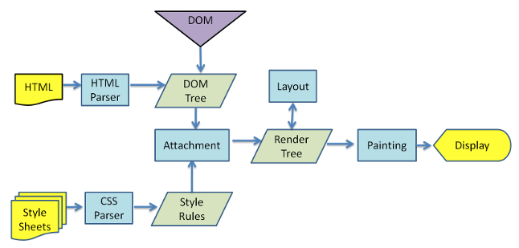
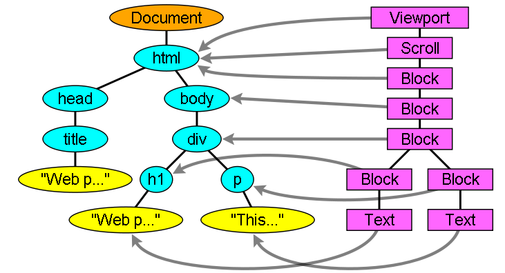
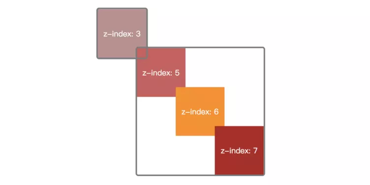

*浏览器相关知识*
<!-- more -->

## 常用浏览器内核

`IE`tridentt内核  

`Chrome` blinkt内核（基于webkit，谷歌与Opera software共同开发）  

`FireFox` geckot内核  

`Safari` webkit内核  

`Opera` blinkt内核(跟Chrome一样)，之前为presto  

## 浏览器页面加载过程（网络篇）


### 从输入url到得到html的详细过程会发生什么？

```javascript
在浏览器地址栏输入了百度的网址:
https://www.baidu.com/
```

1. `构建请求` 浏览器会构建请求行:

    ```javascript
    // 请求方法是GET，路径为根路径，HTTP协议版本为1.1
    GET / HTTP/1.1
    ```

2. `查找强缓存` 先检查强缓存，如果命中直接使用，否则进入下一步

3. `DNS解析` 浏览器根据DNS服务器得到域名的IP地址
    由于我们输入的是域名，而数据包是通过IP地址传给对方的。因此我们需要得到域名对应的IP地址。这个过程需要依赖一个服务系统，这个系统将域名和 IP映射，我们将这个系统就叫做DNS（域名系统）得到具体 IP 的过程就是DNS解析。另外，如果不指定端口的话，默认采用对应的 IP 的 80 端口

4. `建立TCP连接` 这里要提醒一点，Chrome 在同一个域名下要求同时最多只能有 6 个 TCP 连接，超过 6 个的话剩下的请求就得等待。假设现在不需要等待，我们进入了 TCP 连接的建立阶段。首先解释一下什么是 TCP:

    + TCP（Transmission Control Protocol，传输控制协议）是一种面向连接的、可靠的、基于字节流的传输层通信协议。建立 TCP连接经历了下面三个阶段:

    + 通过三次握手(即总共发送3个数据包确认已经建立连接)建立客户端和服务器之间的连接。

    + 进行数据传输。这里有一个重要的机制，就是接收方接收到数据包后必须要向发送方确认, 如果发送方没有接到这个确认的消息，就判定为数据包丢失，并重新发送该数据包。当然，发送的过程中还有一个优化策略，就是把大的数据包拆成一个个小包，依次传输到接收方，接收方按照这个小包的顺序把它们组装成完整数据包。

    + 断开连接的阶段。数据传输完成，现在要断开连接了，通过四次挥手来断开连接。

    + 读到这里，你应该明白 TCP 连接通过什么手段来保证数据传输的可靠性，一是三次握手确认连接，二是数据包校验保证数据到达接收方，三是通过四次挥手断开连接。

    + 当然，如果再深入地问，比如为什么要三次握手，两次不行吗？第三次握手失败了怎么办？为什么要四次挥手等等这一系列的问题，涉及计算机网络的基础知识，比较底层，但是也是非常重要的细节，希望你能好好研究一下，另外这里有一篇不错的文章，[点击进入相应的推荐文章](https://zhuanlan.zhihu.com/p/86426969)，相信这篇文章能给你启发

5. `发送http请求` 现在TCP连接建立完毕，浏览器可以和服务器开始通信，即开始发送 HTTP 请求。浏览器发 HTTP 请求要携带三样东西:请求行、请求头和请求体

6. `服务器处理，响应请求` HTTP 请求到达服务器，服务器进行对应的处理。最后要把数据传给浏览器，也就是返回网络响应。跟请求部分类似，网络响应具有三个部分:响应行、响应头和响应体

    + 响应完成之后怎么办？TCP 连接就断开了吗？

    + 不一定。这时候要判断Connection字段, 如果请求头或响应头中包含  ，表示建立了持久连接，这样TCP连接会一直保持，之后请求统一站点的资源会复用这个连接。否则断开TCP连接, 请求-响应流程结束。

7. 浏览器得到返回的内容

### window.onload和DOMContentLoaded的区别

```javascript
window.addEventListener('load', function () {
  // 页面全部资源加载完才会执行，包括图片、视频等

})


window.addEventListener('DOMContentLoaded', function () {
  // DOM渲染完即可执行，此时图片、视频还没加载完
})
```

对于第一点，首先要明白几点：

+ 加载资源的形式

    1. 加载html的静态资源，比如`<script>，,<link>,<frame>`等标签元素加载资源

    2. 输入url（或跳转页面）加载html，比如输入网址跳转至页面

+ 加载一个资源的过程

    a. 浏览器根据DNS服务器得到域名的IP地址

    b. 向这个IP的机器发送http(s)请求

    c. 服务器收到，处理并返回http请求，比如返回图片或html代码等

    d. 浏览器得到返回内容

+ 浏览器渲染页面的过程

    a. 根据HTML结构生产DOM Tree（只是一个DOM结构，没有样式）

    b. 根据CSS生产CSSOM（CSS Object model只是一个样式结构）

    c. 将DOM和CSSOM整合成RenderTree（渲染树）

    d. 根据RenderTree开始渲染和展示

    e. 遇到`<script>`时，会执行并阻塞渲染（遇到JS会阻塞渲染，因为JS有权利改变DOM结构，所以得规定先后顺序）

⚠️ 思考：为何要把css放在head中？

如果不把css放在head中，会导致多次渲染，严重影响用户体验同时会损耗性能。CSS一定要放在head中，等body里面的东西出来前就要加载完

### 浏览器渲染页面过程与页面优化

> 由一道面试题引发的思考：从用户输入浏览器输入url到页面最后呈现有哪些过程？一道很常规的题目，考的是基本网络原理，和浏览器加载css，js过程答案大致如下：
> 用户输入URL地址
> 构建请求
> 查找强缓存
> 浏览器解析URL解析出主机名或向DNS服务商进行域名解析
> 浏览器将主机名转换成服务器ip地址（浏览器先查找本地DNS缓存列表 没有的话 再向浏览器默认的DNS服务器发送查询请求 同时缓存）
> 浏览器将端口号从URL中解析出来
> 浏览器建立一条与目标Web服务器的TCP连接（三次握手）
> 浏览器向服务器发送一条HTTP请求报文
> 服务器向浏览器返回一条HTTP响应报文
> 关闭连接 浏览器解析文档
> 如果文档中有资源 重复6 7 8 动作 直至资源全部加载完毕
> 以上答案基本简述了一个网页基本的响应过程背后的原理
> 但这也只是一部分，浏览器获取数据的部分，至于浏览器拿到数据之后，怎么渲染页面的，一直没太关注
> 所以抽出时间研究下浏览器渲染页面的过程
> 通过研究，了解一些基本常识的原理：
> 为什么要将js放到页脚部分
> 引入样式的几种方式的权重
> css属性书写顺序建议
> 何种类型的DOM操作是耗费性能的

## 浏览器渲染主要流程 (渲染过程篇)


不同浏览器内核不同，渲染过程不太一样

Webkit 主流程



Mozilla的Gecko呈现引擎主流程


浏览器的加载渲染过程


由上面图可以看出，虽然主流浏览器渲染过程叫法有区别，但是主要流程还是相同的

Gecko 将视觉格式化元素组成的树称为“框架树”。每个元素都是一个框架。WebKit 使用的术语是“呈现树”，它由“呈现对象”组成。

对于元素的放置，WebKit 使用的术语是“布局”，而 Gecko 称之为“重排”。

对于连接 DOM 节点和可视化信息从而创建呈现树的过程，WebKit 使用的术语是“附加”。

所以可以分析出基本过程：

Javascript(DOM) -> Composite

1. 处理 HTML 标记，并且解析HTML生成 DOM 树
2. 处理 CSS 标记, 解析出Style Rules
3. 将前二者关联生成渲染树
4. Layout 根据Render Tree计算每个节点的几何信息
5. Painting 根据计算好的信息绘制整个页面,在屏幕上绘制（重绘）各个节点

### HTML解析（HTML Parser）

HTML Parser的任务是将HTML标记解析成DOM Tree

这个解析可以参考React解析DOM的过程，

但是这里面有很多别的规则和操作，比如容错机制，识别`</br>`和`<br>`等等

感兴趣的可以参考 [《How Browser Work》](https://www.html5rocks.com/zh/tutorials/internals/howbrowserswork/)

```html
<html>
<head>
    <title>Web page parsing</title>
</head>
<body>
    <div>
        <h1>Web page parsing</h1>
        <p>This is an example Web page.</p>
    </div>
</body>
</html>
```


将文本的HTML文档，提炼出关键信息，嵌套层级的树形结构，便于计算拓展。这就是HTML Parser的作用

由于浏览器无法直接理解 `HTML字符串`，因此将这一系列的字节流转换为一种有意义并且方便操作的数据结构，这种数据结构就是DOM树。

*DOM树本质上是一个以document为根节点的多叉树。*

那通过什么样的方式来进行解析呢？

#### HTML文法的本质

首先，我们应该清楚把握一点: HTML 的文法并不是 `上下文无关文法`
这里，有必要讨论一下什么是 `上下文无关文法`
在计算机科学的编译原理学科中，有非常明确的定义:

> 若一个形式文法G = (N, Σ, P, S) 的产生式规则都取如下的形式：V->w，则叫上下文无关语法。其中 V∈N ，w∈(N∪Σ)*

其中把 G = (N, Σ, P, S) 中各个参量的意义解释一下:

+ N 是非终结符(顾名思义，就是说最后一个符号不是它, 下面同理)集合。
+ Σ 是终结符集合。
+ P 是开始符，它必须属于 N ，也就是非终结符。
+ S 就是不同的产生式的集合。如 S -> aSb 等等。

通俗一点讲，`上下文无关的文法` 就是说这个文法中所有产生式的左边都是一个非终结符。
看到这里，如果还有一点懵圈，我举个例子你就明白了。比如:

```javascript
A -> B
```

这个文法中，每个产生式左边都会有一个非终结符，这就是上下文无关的文法。在这种情况下，xBy一定是可以规约出xAy的。

我们下面看看看一个反例：

```javascript
aA -> B
Aa -> B
```

这种情况就是 ，当遇到B的时候，我们不知道到底能不能规约出A，取决于左边或者右边是否有a存在，也就是说和上下文有关。

关于它为什么是 ，首先需要让大家注意的是，规范的 HTML 语法，是符合上下文无关文法的，能够体现它非上下文无关的是不标准的语法。在此我仅举一个反例即可证明。

比如解析器扫描到form标签的时候，上下文无关文法的处理方式是直接创建对应 form 的 DOM 对象，而真实的 HTML5 场景中却不是这样，解析器会查看 form 的上下文，如果这个 form 标签的父标签也是 form, 那么直接跳过当前的 form 标签，否则才创建 DOM 对象。

常规的编程语言都是上下文无关的，而HTML却相反，也正是它非上下文无关的特性，决定了HTML Parser并不能使用常规编程语言的解析器来完成，需要另辟蹊径。

#### 解析算法

HTML5 规范详细地介绍了解析算法。这个算法分为两个阶段:

+ 标记化 (词法分析)

+ 建树 (语法分析)

##### 标记化算法

这个算法输入为HTML文本，输出为HTML标记，也成为标记生成器。其中运用有限自动状态机来完成。即在当当前状态下，接收一个或多个字符，就会更新到下一个状态。

```javascript
<html>
  <body>
    Hello sanyuan
  </body>
</html>
```

通过一个简单的例子来演示一下标记化的过程。

遇到 `<`, 状态为标记打开。

接收 `[a-z]` 的字符，会进入标记名称状态。

这个状态一直保持，直到遇到 `>`，表示标记名称记录完成，这时候变为数据状态。

接下来遇到body标签做同样的处理。

这个时候html和body的标记都记录好了。

现在来到`<body>`中的 `>` ，进入数据状态，之后保持这样状态接收后面的字符hello sanyuan。

接着接收 `</body>` 中的 `<`，回到标记打开, 接收下一个/后，这时候会创建一个 `end tag` 的token。

随后进入标记名称状态, 遇到 `>` 回到数据状态。

接着以同样的样式处理 `</body>`。

##### 建树算法

之前提到过，DOM 树是一个以document为根节点的多叉树。因此解析器首先会创建一个document对象。标记生成器会把每个标记的信息发送给建树器。建树器接收到相应的标记时，会创建对应的 DOM 对象。创建这个DOM对象后会做两件事情:

+ 将DOM对象加入 DOM 树中。
+ 将对应标记压入存放开放(与闭合标签意思对应)元素的栈中。

```javascript
<html>
  <body>
    Hello sanyuan
  </body>
</html>
```

首先，状态为初始化状态。

接收到标记生成器传来的 `html` 标签，这时候状态变为before html状态。同时创建一个 `HTMLHtmlElement` 的 DOM 元素, 将其加到document根对象上，并进行压栈操作。

接着状态自动变为before head, 此时从标记生成器那边传来body，表示并没有head, 这时候建树器会自动创建一个HTMLHeadElement并将其加入到DOM树中。

现在进入到in head状态, 然后直接跳到after head。

现在标记生成器传来了body标记，创建HTMLBodyElement, 插入到DOM树中，同时压入开放标记栈。

接着状态变为in body，然后来接收后面一系列的字符: Hello sanyuan。接收到第一个字符的时候，会创建一个Text节点并把字符插入其中，然后把Text节点插入到 DOM 树中body元素的下面。随着不断接收后面的字符，这些字符会附在Text节点上。

现在，标记生成器传过来一个body的结束标记，进入到after body状态。

标记生成器最后传过来一个html的结束标记, 进入到after after body的状态，表示解析过程到此结束。

##### 容错机制

讲到HTML5规范，就不得不说它强大的宽容策略, 容错能力非常强，虽然大家褒贬不一，不过我想作为一名资深的前端工程师，有必要知道HTML Parser在容错方面做了哪些事情。

接下来是 WebKit 中一些经典的容错示例，发现有其他的也欢迎来补充。

1. 使用的是 `<br>` 会被全部换为 `</br>` 的形式

    ```javascript
        if (t->isCloseTag(brTag) && m_document->inCompatMode()) {
            reportError(MalformedBRError);
            t->beginTag = true;
        }
    ```

2. 表格离散

    ```html
        <table>
            <table>
                <tr><td>inner table</td></tr>
            </table>
            <tr><td>outer table</td></tr>
        </table>
    ```

    WebKit会自动转换为

    ```html
        <table>
            <tr><td>outer table</td></tr>
        </table>
        <table>
            <tr><td>inner table</td></tr>
        </table>
    ```

3. 表单元素嵌套

    这时候直接忽略里面的form

### CSS解析（CSS Parser)

CSS Parser将CSS解析成Style Rules，Style Rules也叫CSSOM（CSS Object Model）

StyleRules也是一个树形结构，根据CSS文件整理出来的类似DOM Tree的树形结构：


与HTML Parser相似，CSS Parser作用就是将很多个CSS文件中的样式合并解析出具有树形结构Style Rules

#### 格式化样式表

首先，浏览器是无法直接识别 CSS 样式文本的，因此渲染引擎接收到 CSS 文本之后第一件事情就是将其转化为一个结构化的对象，即 `styleSheets`

这个格式化的过程过于复杂，而且对于不同的浏览器会有不同的优化策略，这里就不展开了。

在浏览器控制台能够通过

```javascript
document.styleSheets
```

来查看这个最终的结构。当然，这个结构包含了以上三种CSS来源，为后面的样式操作提供了基础。

#### 标准化样式属性

有一些 CSS 样式的数值并不容易被渲染引擎所理解，因此需要在计算样式之前将它们标准化,如

em -> px
red -> #ff0000
bold -> 700

等等

#### 计算每个节点的具体样式

样式已经被格式化和标准化,接下来就可以计算每个节点的具体样式信息了。

其实计算的方式也并不复杂，主要就是两个规则: 继承和层叠。

每个子节点都会默认继承父节点的样式属性，如果父节点中没有找到，就会采用浏览器默认样式，也叫 `UserAgent` 样式。这就是继承规则，非常容易理解。

然后是层叠规则，CSS 最大的特点在于它的层叠性，也就是最终的样式取决于各个属性共同作用的效果，甚至有很多诡异的层叠现象，看过《CSS世界》的同学应该对此深有体会，具体的层叠规则属于深入 CSS 语言的范畴，这里就不过多介绍了。

不过值得注意的是，在计算完样式之后，所有的样式值会被挂在到

```javascript
window.getComputedStyle(element, null)[attr] 
element.currentStyle[attr]

    /**
     * @description 获取任意一个元素的任意一个属性的当前的值---当前属性的位置值
     * @author 一缕清风
     * @param {*} element
     * @param {*} attr
     * @returns  
     */
    static getStyle(element, attr) {
        return window.getComputedStyle ? 
        window.getComputedStyle(element, null)[attr] :  
        element.currentStyle[attr] || 0;
    }
```

当中，也就是可以通过JS来获取计算后的样式，非常方便

#### 样式计算

关于CSS样式，它的来源一般是三种:

+ link标签引用

+ style标签中的样式

+ 元素的内嵌style属性

样式计算是个很复杂的问题。DOM中的一个元素可以对应样式表中的多个元素。样式表包括了所有样式：浏览器默认样式表，自定义样式表，inline样式元素，HTML可视化属性如：width=100。后者将转化以匹配CSS样式

> WebKit 节点会引用样式对象 (RenderStyle)。这些对象在某些情况下可以由不同节点共享。这些节点是同级关系，并且：
>
> 1. 这些元素必须处于相同的鼠标状态（例如，不允许其中一个是“:hover”状态，而另一个不是）
> 2. 任何元素都没有 ID
> 3. 标记名称应匹配
> 4. 类属性应匹配
> 5. 映射属性的集合必须是完全相同的
> 6. 链接状态必须匹配
> 7. 焦点状态必须匹配
> 8. 任何元素都不应受属性选择器的影响，这里所说的“影响”是指在选择器中的任何位置有任何使用了属性选择器的选择器匹配
> 9. 元素中不能有任何 inline 样式属性
> 10. 不能使用任何同级选择器。WebCore 在遇到任何同级选择器时，只会引发一个全局开关，并停用整个文档的样式共享（如果存在）。这包括 + 选择器以及 :first-child 和 :last-child 等选择器。

为了简化样式计算，Firefox 还采用了另外两种树：规则树和样式上下文树。WebKit 也有样式对象，但它们不是保存在类似样式上下文树这样的树结构中，只是由 DOM 节点指向此类对象的相关样式。


样式上下文包含端值。要计算出这些值，应按照正确顺序应用所有的匹配规则，并将其从逻辑值转化为具体的值。

例如，如果逻辑值是屏幕大小的百分比，则需要换算成绝对的单位。规则树的点子真的很巧妙，它使得节点之间可以共享这些值，以避免重复计算，还可以节约空间。

所有匹配的规则都存储在树中。路径中的底层节点拥有较高的优先级。规则树包含了所有已知规则匹配的路径。规则的存储是延迟进行的。规则树不会在开始的时候就为所有的节点进行计算，而是只有当某个节点样式需要进行计算时，才会向规则树添加计算的路径。

举个例子 我们有段HTML代码：

```html
<html>
  <body>
    <div class="err" id="div1">
      <p>
        this is a <span class="big"> big error </span>
        this is also a
        <span class="big"> very  big  error</span> error
      </p>
    </div>
    <div class="err" id="div2">another error</div>
  </body>
</html>
```

对应CSS规则如下：

```css
1. .div {margin:5px;color:black}
2. .err {color:red}
3. .big {margin-top:3px}
4. div span {margin-bottom:4px}
5. #div1 {color:blue}
6. #div2 {color:green}
```

则CSS形成的规则树如下图所示（节点的标记方式为“节点名 : 指向的规则序号”）


假设我们解析 HTML 时遇到了第二个 `<div>` 标记，我们需要为此节点创建样式上下文，并填充其样式结构。

经过规则匹配，我们发现该 `<div>` 的匹配规则是第 1、2 和 6 条。这意味着规则树中已有一条路径可供我们的元素使用，我们只需要再为其添加一个节点以匹配第 6 条规则（规则树中的 F 节点）。

我们将创建样式上下文并将其放入上下文树中。新的样式上下文将指向规则树中的 F 节点。
现在我们需要填充样式结构。首先要填充的是 margin 结构。由于最后的规则节点 (F) 并没有添加到 margin 结构，我们需要上溯规则树，直至找到在先前节点插入中计算过的缓存结构，然后使用该结构。我们会在指定 margin 规则的最上层节点（即 B 节点）上找到该结构。

我们已经有了 color 结构的定义，因此不能使用缓存的结构。由于 color 有一个属性，我们无需上溯规则树以填充其他属性。我们将计算端值（将字符串转化为 RGB 等）并在此节点上缓存经过计算的结构。

第二个 `<span>` 元素处理起来更加简单。我们将匹配规则，最终发现它和之前的 span 一样指向规则 G。由于我们找到了指向同一节点的同级，就可以共享整个样式上下文了，只需指向之前 span 的上下文即可。

对于包含了继承自父代的规则的结构，缓存是在上下文树中进行的（事实上 color 属性是继承的，但是 Firefox 将其视为 reset 属性，并缓存到规则树上）

所以生成的上下文树如下：


#### 以正确的层叠顺序应用规则

样式对象具有与每个可视化属性一一对应的属性（均为 CSS 属性但更为通用）。如果某个属性未由任何匹配规则所定义，那么部分属性就可由父代元素样式对象继承。其他属性具有默认值。

如果定义不止一个，就会出现问题，需要通过层叠顺序来解决。

一些例子：

```css
*             {}  /* a=0 b=0 c=0 d=0 -> specificity = 0,0,0,0 */
 li            {}  /* a=0 b=0 c=0 d=1 -> specificity = 0,0,0,1 */
 li:first-line {}  /* a=0 b=0 c=0 d=2 -> specificity = 0,0,0,2 */
 ul li         {}  /* a=0 b=0 c=0 d=2 -> specificity = 0,0,0,2 */
 ul ol+li      {}  /* a=0 b=0 c=0 d=3 -> specificity = 0,0,0,3 */
 h1 + *[rel=up]{}  /* a=0 b=0 c=1 d=1 -> specificity = 0,0,1,1 */
 ul ol li.red  {}  /* a=0 b=0 c=1 d=3 -> specificity = 0,0,1,3 */
 li.red.level  {}  /* a=0 b=0 c=2 d=1 -> specificity = 0,0,2,1 */
 #x34y         {}  /* a=0 b=1 c=0 d=0 -> specificity = 0,1,0,0 */
 style=""          /* a=1 b=0 c=0 d=0 -> specificity = 1,0,0,0 */
```

利用上面的方法，基本可以快速确定不同选择器的优先级

### JavaScript脚本处理

主要是通过DOM API和CSSOM API来操作DOM Tree和CSS Rule Tree

浏览器解析文档，当遇到 `<script>` 标签的时候，会立即解析脚本，停止解析文档（因为JS可能会改动DOM和CSS，所以继续解析会造成浪费）

如果脚本是外部的，会等待脚本下载完毕，再继续解析文档

可以在script标签上增加属性 `defer` 或者 `async`

脚本解析会将脚本中改变DOM和CSS的地方分别解析出来，追加到DOM Tree和Style Rules上

### 构建DOM树（DOM Tree）

### 呈现树（Render Tree）

Render Tree的构建其实就是DOM Tree和CSSOM Attach的过程

呈现器是和 DOM 元素相对应的，但并非一一对应。Render Tree实际上就是一个计算好样式，与HTML对应的（包括哪些显示，那些不显示）的Tree。

> 在 WebKit 中，解析样式和创建呈现器的过程称为“附加”。每个 DOM 节点都有一个“attach”方法。附加是同步进行的，将节点插入 DOM 树需要调用新的节点“attach”方法。



### 布局（Layout Tree）

布局的细节强烈推荐你去读一读 [从Chrome源码看浏览器如何layout布局](https://www.rrfed.com/2017/02/26/chrome-layout/)

创建渲染树后，下一步就是 `布局重排(relayout)` 或者叫 `回流(reflow)`，这个过程就是通过渲染树中渲染对象的信息，计算出每一个渲染对象的位置和尺寸，将其安置在浏览器窗口的正确位置，而有些时候我们会在文档布局完成后对DOM进行修改，这时候可能需要重新进行布局，也可称其为回流，本质上还是一个布局的过程，每一个渲染对象都有一个布局或者回流方法，实现其布局或回流。

对渲染树的布局可以分为全局和局部的:

+ 全局即对整个渲染树进行重新布局，如当我们改变了窗口尺寸或方向或者是修改了根元素的尺寸或者字体大小等；

+ 而局部布局可以是对渲染树的某部分或某一个渲染对象进行重新布局

大多数web应用对DOM的操作都是比较频繁，这意味着经常需要对DOM进行布局和回流，而如果仅仅是一些小改变，就触发整个渲染树的回流，这显然是不好的，为了避免这种情况，浏览器使用了脏位系统，只有一个渲染对象改变了或者某渲染对象及其子渲染对象脏位值为 "dirty" 时，说明需要回流。

表示需要布局的脏位值有两种：

+ "dirty" –自身改变，需要回流
+ "children are dirty" –子节点改变，需要回流

布局是一个从上到下，从外到内进行的递归过程，从根渲染对象，即对应着HTML文档根元素，然后下一级渲染对象，如对应着元素，如此层层递归，依次计算每一个渲染对象的几何信息（位置和尺寸）

每一个渲染对象的布局流程基本如：

1. 计算此渲染对象的宽度（width）
2. 遍历此渲染对象的所有子级，依次：
    + 设置子级渲染对象的坐标
    + 判断是否需要触发子渲染对象的布局或回流方法，计算子渲染对象的高度（height）
3. 设置此渲染对象的高度：根据子渲染对象的累积高，margin和padding的高度设置其高度；
4. 设置此渲染对象脏位值为false

### 绘制（Painting）

在绘制阶段，系统会遍历呈现树，并调用呈现器的 `paint` 方法，将呈现器的内容显示在屏幕上。绘制工作是使用用户界面基础组件完成的。

CSS2 规范定义了绘制流程的顺序。绘制的顺序其实就是元素进入堆栈样式上下文的顺序。这些堆栈会从后往前绘制，因此这样的顺序会影响绘制。块呈现器的堆栈顺序如下：

1. 背景颜色
2. 背景图片
3. 边框
4. 子代
5. 轮廓

这里还要说两个概念，一个是Reflow，另一个是Repaint。这两个不是一回事

+ `Repaint` 屏幕的一部分要重画，比如某个CSS的背景色变了。但是元素的几何尺寸没有变。
+ `Reflow` 元件的几何尺寸变了，我们需要重新验证并计算Render Tree。是Render Tree的一部分或全部发生了变化。这就是Reflow，或是Layout

  + HTML使用的是flow based layout，也就是流式布局。所以，如果某元件的几何尺寸发生了变化，需要重新布局，也就叫reflow

  + reflow 会从`<html>`这个root frame开始递归往下，依次计算所有的结点几何尺寸和位置，在reflow过程中，可能会增加一些frame，比如一个文本字符串必需被包装起来。

  + Reflow的成本比Repaint的成本高得多的多。DOM Tree里的每个结点都会有reflow方法，一个结点的reflow很有可能导致子结点，甚至父点以及同级结点的reflow。在一些高性能的电脑上也许还没什么，但是如果reflow发生在手机上，那么这个过程是非常痛苦和耗电的

所以，下面这些动作有很大可能会是成本比较高的

+ 当你增加、删除、修改DOM结点时，会导致 Reflow/Repaint
+ 当你移动DOM的位置，或是搞个动画的时候
+ 当你修改CSS样式的时候
+ 当你Resize窗口的时候（移动端没有这个问题），或是滚动的时候
+ 当你修改网页的默认字体时

⚠️注意: display:none会触发reflow，而visibility:hidden只会触发repaint，因为没有发现位置变化

基本上来说，reflow有如下的几个原因:

+ `initial` 网页初始化的时候。
+ `Incremental` 一些Javascript在操作DOM Tree时
+ `Resize` 其些元件的尺寸变了
+ `StyleChange` 如果CSS的属性发生变化了
+ `Dirty` 几个Incremental的reflow发生在同一个frame的子树上

看几个例子：

```javascript
$('body').css('color', 'red');        // repaint
$('body').css('margin', '2px');       // reflow, repaint
var bstyle = document.body.style;     // cache
bstyle.padding = "20px";             // reflow, repaint
bstyle.border = "10px solid red";    //  再一次的 reflow 和 repaint
bstyle.color = "blue";               // repaint
bstyle.backgroundColor = "#fad";     // repaint
bstyle.fontSize = "2em";             // reflow, repaint

// new DOM element - reflow, repaint
document.body.appendChild(document.createTextNode('dude!'));
```

当然，我们的浏览器是聪明的，它不会像上面那样，你每改一次样式，它就reflow或repaint一次。一般来说，浏览器会把这样的操作积攒一批，然后做一次reflow，这又叫异步reflow或增量异步reflow。但是有些情况浏览器是不会这么做的，比如:

+ resize窗口
+ 改变了页面默认的字体，等...

对于这些操作，浏览器会马上进行reflow
但是有些时候，我们的脚本会阻止浏览器这么干，比如:如果我们请求下面的一些DOM值:

```css
offsetTop, offsetLeft, offsetWidth, offsetHeight
scrollTop, scrollLeft, scrollWidth, scrollHeight
clientTop, clientLeft, clientWidth, clientHeight
getComputedStyle() 或 currentStyle
```

因为，如果我们的程序需要这些值，那么浏览器需要返回最新的值，而这样一样会flush出去一些样式的改变，从而造成频繁的 `reflow/repaint`

### 渲染层合并（Layer Tree Composite)


如果你觉得现在DOM节点也有了，样式和位置信息也都有了，可以开始绘制页面了，那你就错了

因为你考虑掉了另外一些复杂的场景，比如3D动画如何呈现出变换效果，当元素含有层叠上下文时如何控制显示和隐藏等等

由上一步可知，对页面中DOM元素的绘制是在多个层上进行的。在每个层上完成绘制过程之后，浏览器会将所有层按照合理的顺序合并成一个图层，然后显示在屏幕上。对于有位置重叠的元素的页面，这个过程尤其重要，因为一旦图层的合并顺序出错，将会导致元素显示异常

为了解决如上所述的问题，浏览器在构建完布局树之后，还会对特定的节点进行分层，构建一棵 `图层树（Layer Tree)`

#### 什么是渲染层合成？

在 DOM 树中每个节点都会对应一个渲染对象（RenderObject），当它们的渲染对象处于相同的坐标空间（z 轴空间）时，就会形成一个 RenderLayers，也就是渲染层。渲染层将保证页面元素以正确的顺序堆叠，这时候就会出现层合成（composite），从而正确处理透明元素和重叠元素的显示。

这个模型类似于 Photoshop 的图层模型，在 Photoshop 中，每个设计元素都是一个独立的图层，多个图层以恰当的顺序在 z 轴空间上叠加，最终构成一个完整的设计图。

对于有位置重叠的元素的页面，这个过程尤其重要，因为一旦图层的合并顺序出错，将会导致元素显示异常

#### 浏览器的渲染原理

从浏览器的渲染过程中我们知道，页面 HTML 会被解析成 DOM 树，每个 HTML 元素对应了树结构上的一个 node 节点。而从 DOM 树转化到一个个的渲染层，并最终执行合并、绘制的过程，中间其实还存在一些过渡的数据结构，它们记录了 DOM 树到屏幕图形的转化原理，其本质也就是树结构到层结构的演化。


#### 渲染对象（RenderObject)

一个 DOM 节点对应了一个渲染对象，渲染对象依然维持着 DOM 树的树形结构。一个渲染对象知道如何绘制一个 DOM 节点的内容，它通过向一个绘图上下文（GraphicsContext）发出必要的绘制调用来绘制 DOM 节点

#### 渲染层(RenderLayer)

这是浏览器渲染期间构建的第一个层模型，处于相同坐标空间（z轴空间）的渲染对象，都将归并到同一个渲染层中，因此根据层叠上下文，不同坐标空间的的渲染对象将形成多个渲染层，以体现它们的层叠关系。所以，对于满足形成层叠上下文条件的渲染对象，浏览器会自动为其创建新的渲染层。能够导致浏览器为其创建新的渲染层的，包括以下几类常见的情况：

+ 有 根元素 document
+ 有 明确的定位属性position(relative、fixed、sticky、absolute、static）并且设置了z-index属性
+ 有 opacity < 1
+ 有 CSS fliter属性值不是 none
+ 有 CSS mask 属性
+ 有 CSS mix-blend-mode 属性且值不为 normal
+ 有 CSS transform 属性且值不为 none
+ 有 backface-visibility 属性为 hidden
+ 有 CSS reflection 属性
+ 有 CSS column-count 属性且值不为 auto 或 CSS column-width 属性且值不+ 为 auto
+ 有 对于 opacity、transform、fliter、backdrop-filter 应用动画
+ 有 元素的isolation值是isolate
+ 有 overflow 不为 visible
will-change指定的属性值为(transform、filter、isolation等）

DOM 节点和渲染对象是一一对应的，满足以上条件的渲染对象就能拥有独立的渲染层。当然这里的独立是不完全准确的，并不代表着它们完全独享了渲染层，由于不满足上述条件的渲染对象将会与其第一个拥有渲染层的父元素共用同一个渲染层，因此实际上，这些渲染对象会与它的部分子元素共用这个渲染层。

#### 合成层（CompositingLayer）

满足某些特殊条件的渲染层，会被浏览器自动提升为合成层。合成层拥有单独的 GraphicsLayer，而其他不是合成层的渲染层，则和其第一个拥有 GraphicsLayer 的父层共用一个。

那么一个渲染层满足哪些特殊条件时，才能被提升为合成层呢？这里列举了一些常见的情况：

+ 3D transforms：translate3d、translateZ 等
+ video、canvas、iframe 等元素
+ 通过 Element.animate() 实现的 opacity 动画转换
+ 通过 СSS 动画实现的 opacity 动画转换
+ position: fixed
+ 具有 will-change 属性
+ 对 opacity、transform、fliter、backdropfilter 应用了 animation 或者 transition

因此，文首例子的解决方案，其实就是利用 will-change 属性，将 CPU 消耗高的渲染元素提升为一个新的合成层，才能开启 GPU 加速的，因此你也可以使用 `transform: translateZ(0)` 来解决这个问题。
这里值得注意的是，不少人会将这些合成层的条件和渲染层产生的条件混淆，这两种条件发生在两个不同的层处理环节，是完全不一样的。

另外，有些文章会把 CSS Filter 也列为影响 Composite 的因素之一，然而我验证后发现并没有效果

#### 隐式合成

上边提到，满足某些显性的特殊条件时，渲染层会被浏览器提升为合成层。除此之外，在浏览器的Composite阶段，还存在一种隐式合成，部分渲染层在一些特定场景下，会被默认提升为合成层。

对于隐式合成，CSS GPU Animation 中是这么描述的：

> This is called implicit compositing: One or more non-composited elements that should appear above a composited one in the stacking order are promoted to composite layers. (一个或多个非合成元素应出现在堆叠顺序上的合成元素之上，被提升到合成层。)

这句话可能不好理解，它其实是在描述一个交叠问题（overlap）。举个例子说明一下：

+ 两个absolute定位的div在屏幕上交叠了，根据`z-index`的关系，其中一个div就会盖在另外一个上边

    

+ 这个时候，如果处于下方的div被加上了CSS属性: `transform: translateZ(0)`,就会被浏览器提升为合成层。提升后的合成层位于Document上方，假如没有隐式合成，原本应该处于上方的div就依然还是跟Document共用一个GraphicsLayer，层级反而降了，就出现元素交叠关系错乱的问题。

    

+ 所以为了纠正错误的交叠顺序，浏览器必须让原本应该“盖在”它上边的渲染层也同时提升为合成层。

    

#### 层爆炸和层压缩

##### 层爆炸

从上边的研究中我们可以发现，一些产生合成层的原因太过于隐蔽了，尤其是隐式合成。在平时的开发过程中，我们很少会去关注层合成的问题，很容易就产生一些不在预期范围内的合成层，当这些不符合预期的合成层达到一定量级时，就会变成层爆炸。

层爆炸会占用 GPU 和大量的内存资源，严重损耗页面性能，因此盲目地使用 GPU 加速，结果有可能会是适得其反。

[CSS3硬件加速也有坑](https://www.yuque.com/r/goto?url=https%3A%2F%2Fdiv.io%2Ftopic%2F1348) 这篇文章提供了一个很有趣的 [DEMO](https://www.yuque.com/r/goto?url=http%3A%2F%2Ffouber.github.io%2Ftest%2Flayer%2F)

这个 DEMO 页面中包含了一个 h1 标题，它对 transform 应用了 animation 动画，进而导致被放到了合成层中渲染。由于 animation transform 的特殊性（动态交叠不确定），隐式合成在不需要交叠的情况下也能发生，就导致了页面中所有 `z-index` 高于它的节点所对应的渲染层全部提升为合成层，最终让这个页面整整产生了几千个合成层。

消除隐式合成就是要消除元素交叠，拿这个 DEMO 来说，我们只需要给 h1 标题的 `z-index` 属性设置一个较高的数值，就能让它高于页面中其他元素，自然也就没有合成层提升的必要了。点击 DEMO 中的复选按钮就可以给 h1 标题加上一个较大的 `z-index`，前后效果对比十分明显。


```html
<!DOCTYPE html>
<html>

  <head>
    <meta charset="utf-8">
    <title>Composited layer</title>
    <meta name="viewport" content="width=device-width, initial-scale=1, user-scalable=no" />
    <style type="text/css">
      body { font-family: 'Helvetica Neue', 'Microsoft Yahei', sans-serif; }
      h1 { font-size: 20px; }
      a { color: #888; text-decoration: none; }
      div { overflow: hidden; }
      ul { margin: 5px; padding: 0; }
      li { position: relative; height: 30px; overflow: hidden; border-top: 1px dotted #ccc; padding: 5px 20px 5px 40px; font-size: 20px; } img { width: 30px; height: 30px; position: absolute; left: 3px; top: 4px; border: 1px solid #ccc; }
      time { position: absolute; right: 5px; top: 4px; font-size: 12px; color: #999; }
      label { display: block; margin: 10px 5px; color: red; }
      input { vertical-align: middle; }
      @-webkit-keyframes move { 0% { -webkit-transform: translateX(0px) } 50% { -webkit-transform: translateX(10px) } 100% { -webkit-transform: translateX(0px) } }
      @-moz-keyframes move { 0% { -moz-transform: translateX(0px) } 50% { -moz-transform: translateX(10px) } 100% { -moz-transform: translateX(0px) } }
      @-o-keyframes move { 0% { -o-transform: translateX(0px) } 50% { -o-transform: translateX(10px) } 100% { -o-transform: translateX(0px) } }
      @keyframes move { 0% { transform: translateX(0px) } 50% { transform: translateX(10px) } 100% { transform: translateX(0px) } }
      #title {
        -webkit-animation: move 1s linear infinite;
        -moz-animation: move 1s linear infinite;
        -o-animation: move 1s linear infinite;
        animation: move 1s linear infinite;
        /*position: relative;
            z-index: 1;*/
      }
    </style>
  </head>

  <body>
    <div>
      <h1 id="title">请使用具备『硬件加速』功能的『安卓』手机浏览此页面</h1>
      <label>
        <input type="checkbox" onchange="setZIndex(this)"> 为动画元素设置z-index
      </label>
    </div>
    <ul id="list"></ul>
  </body>

  <script>
    // 处理query
    var query = (function (query) {
      var q = {};
      query = query.replace(/^\?+/, '');
      if (query) {
        query.split('&').forEach(function (i) {
          i = i.split('=');
          q[i[0]] = i[1];
        });
      }
      return q;
    })(location.search);
  </script>

  <script>
    var $ = function (selector) {
      return document.querySelector(selector)
    }

    var setZIndex = function (checkbox) {
        var title = $('#title');
        if (checkbox.checked) {
          title.style.position = 'relative';
          title.style.zIndex = 1;
        } else {
          title.style.position = 'static';
        }
      }
  </script>

  <script>
    // 生成DOM
    var template = function (i) {
      return [
        '<li class="album-item">',
        '',
        'hello world  ',
        i,
        '<time>2015-09</time>',
        '</li>'
      ].join('');
    };

    var size = parseInt(query.size) || 1000;
    var html = '';
    for (var i = 0; i < size; i++) {
      html += template(i);
    }
    $('#list').innerHTML = html;
  </script>
</html>
```

#### 层压缩

当然了，面对这种问题，浏览器也有相应的应对策略，如果多个渲染层同一个合成层重叠时，这些渲染层会被压缩到一个 GraphicsLayer 中，以防止由于重叠原因导致可能出现的“层爆炸”。这句话不好理解，具体可以看看这个例子：

+ 还是之前的模型，只不过这次不同的是，有四个 absolute 定位的 div 在屏幕内发生了交叠。此时处于最下方的 div 在加上了 CSS 属性  后被浏览器提升为合成层，如果按照隐式合成的原理，盖在它上边的 div 会提升为一个新的合成层，第三个 div 又盖在了第二个上，自然也会被提升为合成层，第四个也同理。这样一来，岂不是就会产生四个合成层了？

    

+ 然而事实并不是这样的，浏览器的层压缩机制，会将隐式合成的多个渲染层压缩到同一个 GraphicsLayer 中进行渲染，也就是说，上方的三个 div 最终会处于同一个合成层中，这就是浏览器的层压缩。

    

当然了，浏览器的自动层压缩并不是万能的，有很多特定情况下，浏览器是无法进行层压缩的，[无线性能优化：Composite](https://fed.taobao.org/blog/2016/04/26/performance-composite/) 这篇文章列举了许多详细的场景。

#### 图形层

GraphicsLayer 其实是一个负责生成最终准备呈现的内容图形的层模型，它拥有一个图形上下文（GraphicsContext），GraphicsContext 会负责输出该层的位图。存储在共享内存中的位图将作为纹理上传到 GPU，最后由 GPU 将多个位图进行合成，然后绘制到屏幕上，此时，我们的页面也就展现到了屏幕上。

所以 GraphicsLayer 是一个重要的渲染载体和工具，但它并不直接处理渲染层，而是处理合成层。

#### 生成绘制列表

接下来渲染引擎会将图层的绘制拆分成一个个绘制指令，比如先画背景、再描绘边框......然后将这些指令按顺序组合成一个待绘制列表，相当于给后面的绘制操作做了一波计划。

这里我以百度首页为例，大家可以在 Chrome 开发者工具中在设置栏中展开 more tools, 然后选择 `Layers面板`，就能看到下面的绘制列表:


#### 生成图块和生成位图

现在开始绘制操作，实际上在渲染进程中绘制操作是由专门的线程来完成的，这个线程叫合成线程。

绘制列表准备好了之后，渲染进程的主线程会给 `合成线程` 发送 `commit` 消息，把绘制列表提交给合成线程。接下来就是合成线程一展宏图的时候啦。

首先，考虑到视口就这么大，当页面非常大的时候，要滑很长时间才能滑到底，如果要一口气全部绘制出来是相当浪费性能的。因此，合成线程要做的第一件事情就是将图层分块。这些块的大小一般不会特别大，通常是 256 \* 256 或者 512 \* 512 这个规格。这样可以大大加速页面的首屏展示。

因为后面图块数据要进入 GPU 内存，考虑到浏览器内存上传到 GPU 内存的操作比较慢，即使是绘制一部分图块，也可能会耗费大量时间。针对这个问题，Chrome 采用了一个策略: 在首次合成图块时只采用一个低分辨率的图片，这样首屏展示的时候只是展示出低分辨率的图片，这个时候继续进行合成操作，当正常的图块内容绘制完毕后，会将当前低分辨率的图块内容替换。这也是 Chrome 底层优化首屏加载速度的一个手段。

顺便提醒一点，渲染进程中专门维护了一个栅格化线程池，专门负责把图块转换为位图数据。

然后合成线程会选择视口附近的图块，把它交给栅格化线程池生成位图。

生成位图的过程实际上都会使用 GPU 进行加速，生成的位图最后发送给 `合成线程`

### 显示器显示内容

栅格化操作完成后，合成线程会生成一个绘制命令，即"DrawQuad"，并发送给浏览器进程。

浏览器进程中的 `viz组件` 接收到这个命令，根据这个命令，把页面内容绘制到内存，也就是生成了页面，然后把这部分内存发送给显卡。为什么发给显卡呢？我想有必要先聊一聊显示器显示图像的原理。

无论是 PC 显示器还是手机屏幕，都有一个固定的刷新频率，一般是 60 HZ，即 60 帧，也就是一秒更新 60 张图片，一张图片停留的时间约为 16.7 ms。而每次更新的图片都来自显卡的前缓冲区。而显卡接收到浏览器进程传来的页面后，会合成相应的图像，并将图像保存到后缓冲区，然后系统自动将 `前缓冲区` 和 `后缓冲区` 对换位置，如此循环更新。

看到这里你也就是明白，当某个动画大量占用内存的时候，浏览器生成图像的时候会变慢，图像传送给显卡就会不及时，而显示器还是以不变的频率刷新，因此会出现卡顿，也就是明显的掉帧现象

### 页面渲染优化

浏览器对上文介绍的关键渲染路径进行了很多优化，针对每一次变化产生尽量少的操作，还有优化判断重新绘制或布局的方式等等

在改变文档根元素的字体颜色等视觉性信息时，会触发整个文档的重绘，而改变某元素的字体颜色则只触发特定元素的重绘；改变元素的位置信息会同时触发此元素（可能还包括其兄弟元素或子级元素）的布局和重绘。某些重大改变，如更改文档根元素的字体尺寸，则会触发整个文档的重新布局和重绘，据此及上文所述，推荐以下优化和实践：

1. HTML文档结构层次尽量少，最好不深于六层；
2. 脚本尽量后放，放在前即可；
3. 少量首屏样式内联放在标签内；
4. 样式结构层次尽量简单；
5. 在脚本中尽量减少DOM操作，尽量缓存访问DOM的样式信息，避免过度触发回流；
6. 减少通过JavaScript代码修改元素样式，尽量使用修改class名方式操作样式或动画；
7. 动画尽量使用在绝对定位或固定定位的元素上；
8. 隐藏在屏幕外，或在页面滚动时，尽量停止动画；
9. 尽量缓存DOM查找，查找器尽量简洁；
10. 涉及多域名的网站，可以开启域名预解析

#### 开发过程有优化浏览器性能

关于CSS重排和重绘的概念，在制作中考虑浏览器的性能

+ 避免频繁使用 style，而是采用修改class的方式
+ 减少重排能够节省浏览器对其子元素及父类元素的重新渲染
+ 避免过分的重绘也能节省浏览器性能
+ 优化动画，使用3D启用GPU硬件加速
+ 慎重选择高消耗的样式，如:
  + box-shadow
  + border-radius
  + transform
  + transparency
  + CSS filters（性能杀手）
  + 等等
+ 使用  进行批量的 DOM 操作
+ 对于 resize、scroll 等进行防抖/节流处理
+ 添加 will-change: tranform ，让渲染引擎为其单独实现一个图层，当这些变换发生时，仅仅只是利用合成线程去处理这些变换，而不牵扯到主线程，大大提高渲染效率。当然这个变化不限于tranform, 任何可以实现合成效果的 CSS 属性都能用will-change来声明，不了解 CSS 硬件加速的可以看看这篇文章 [Increase Your Site’s Performance with Hardware-Accelerated CSS](https://www.yuque.com/r/goto?url=https%3A%2F%2Fblog.teamtreehouse.com%2Fincrease-your-sites-performance-with-hardware-accelerated-css)

#### 什么是reflow?

我们首先来回顾一下 `渲染流水线` 的流程


浏览器为了重新渲染部分或整个页面，重新计算页面元素位置和几何结构的进程叫做 `reflow` （回流或叫重排） `flow` 通俗点说就是当开发人员定义好了样式后（也包括浏览器的默认样式），浏览器根据这些来计算并根据这些来计算并根据结果将元素放到它应该出现的位置上

`reflow` 是一种浏览器中的用户拦截操作，所以我们了解如何减少reflow次数，及DOM的层级，css效率对reflow次数的影响是十分有必要的。

reflow(回流)是导致DOM脚本执行效率低的关键因素之一，页面上任何一个节点触发了reflow，会导致它的子节点及祖先节点重新渲染。

简单解释一下 reflow：当元素改变的时候，将会影响文档内容或结构，或元素位置，此过程称为reflow。

```html
<body>
  <div class="hello">
    <h4>hello</h4>
    <p><strong>Name:</strong>BDing</p>
    <h5>male</h5>
    <ol>
      <li>coding</li>
      <li>loving</li>
    </ol>
  </div>
</body>
```

当p节点上发生reflow时，class="hello"和body也会重新渲染，甚至h5和ol都会受到影响

#### 回流过程

依照上面的渲染流水线，触发回流的时候，如果 DOM 结构发生改变，则重新渲染 DOM 树，然后将后面的流程(包括主线程之外的任务)全部走一遍


相当于将解析和合成的过程重新又走了一遍，开销是非常大的

#### 什么时候会导致reflow发生呢

+ 改变窗口大小
+ 改变文字大小
+ 添加/删除样式表
+ 内容的改变，(用户在输入框中写入内容也会)
+ 激活伪类，如:hover
+ 操作class属性
+ 脚本操作DOM
+ 计算offsetWidth和offsetHeihgt
+ 设置style属性

|常见的重排元素||||
|---|---|---|---|---|
|width|height|padding|margin|
|display|border-width|border|top|
|position|font-size|float|text-align|
|overflow-y|font-weight|overflow|left|
|font-family|line-height|vertical-align|right|
|clear|white-space|bottom|min-height|

#### 减少reflow对性能的影响的建议

1. 避免频繁使用style，而是采用修改 `class` 的方式。不要一条一条地修改DOM的样式，先预定义好 class，然后修改 DOM 的 `class`

    ```html
        <style>
        .theclassname{
            width: 100px;
            height: 100px;
        }
        </style>
        <script>
            // bad
            var left = 10,
            top = 10;
            el.style.left = left + "px";
            el.style.top = top + "px";

            // Good
            el.className += " theclassname";

            // Good
            el.style.cssText += "; left: " + left + "px; top: " + top + "px;";
        </script>
    ```

2. 把 DOM 离线后修改，比如:先把 DOM 给 `display:none` (有一次 Reflow)，然后你修改100次，然后再把它显示出来
3. 不要把 DOM 结点的属性值放在一个循环里当成循环里的变量
4. 尽可能不要修改影响范围比较大的 DOM
5. 为动画的元素使用绝对定位 `absolute/fixed` ，这样不会影响其他元素的布局
6. 不要使用 `table` 布局，可能很小的一个小改动会造成整个 table 的重新布局。table中某个元素旦触发了reflow，那么整个table的元素都会触发reflow。那么在不得已使用table的场合，可以设置 `table-layout:auto` 或者是 `table-layout:fixed` 这样可以让table一行一行的渲染，这种做法也是为了限制reflow的影响范围
7. 尽可能限制reflow的影响范围，尽可能在低层级的DOM节点上，上述例子中，如果你要改变p的样式，class就不要加在div上，通过父元素去影响子元素不好。
8. 避免设置大量的style属性，因为通过设置style属性改变结点样式的话，每一次设置都会触发一次reflow，所以最好是使用class属性
9. 动画实现的速度的选择。比如实现一个动画，以1个像素为单位移动这样最平滑，但是reflow就会过于频繁，大量消耗CPU资源，如果以3个像素为单位移动则会好很多。
10. 如果CSS里面有计算表达式，每次都会重新计算一遍，触发一次reflow
11. 对于 resize、scroll 等频繁的的回流采取防抖/节流处理
12. 使用 `createDocumentFragment` 进行批量的 DOM 操作
13. 添加 `will-change: transform` 让渲染引擎为其单独实现一个图层，当这些变换发生时，仅仅只是利用合成线程去处理这些变换，而不牵扯到主线程，大大提高渲染效率。当然这个变化不限于tranform, 任何可以实现合成效果的 CSS 属性都能用will-change来声明。这里有一个实际的例子，一行will-change: tranform拯救一个项目，点击直达

#### 什么是repaint？

##### 触发条件

`paint` 通俗来说，就是当各种盒子的位置、大小以及其他属性，例如颜色、字体都确定下来后，浏览器便把这些元素都按照各自的特性绘制一遍，于是页面的内容出现了

`repaint` 是在一个元素的外观被改变，但没有改变布局的情况下发生的，如改变了visibility、outline、background等。当repaint发生时，浏览器会验证DOM树上所有其他节点的visibility属性

##### 重绘过程


跳过了 `生成布局树` 和 `建图层树` 的阶段，直接生成绘制列表，然后继续进行分块、生成位图等后面一系列操作。
可以看到，重绘不一定导致回流，但回流一定发生了重绘

##### 避免过分重绘（Repaints)

当元素改变的时候，将不会影响元素在页面当中的位置（比如 background-color, border-color, visibility），浏览器仅仅会应用新的样式重绘此元素，此过程称为 Repaint。

|常见的重绘元素||||
|---|---|---|---|---|
|color|border-style|visibility|background|
|text-decoration|background-image|background-position|background-repeat|
|outline-color|outline|outline-style|border-radius|
|outline-width|box-shadow|background-size||

### 使用GPU优化动画

#### 合成

还有一种情况，直接合成。比如利用CSS3的`transform`、`opacity`、`filter`这些属性就可以实现合成的效果，也就是大家常说的GPU加速

#### GPU加速的原因

在合成的情况下，会直接跳过布局和绘制流程，直接进入 `非主线程处理` 的部分，即直接交给 `合成线程` 处理。交给它处理有两大好处：

+ 能够充分发挥 `GPU` 的优势。合成线程生成位图的过程中会调用线程池，并在其中使用GPU进行加速生成，而GPU是擅长处理位图数据的。

+ 没有占用主线程的资源，即使主线程卡住了，效果依然能够流畅地展示

#### 采用GPU加速的方式有哪些

css3 动画是优化的重中之重。除了做到上面两点。减少Reflow和Repaints外，还可以启用GPU硬件加速GPU（Graphics Processing Unit）是图像处理器。

GPU硬件加速是指应用GPU的图形性能对浏览器中的一些图形操作交给GPU来完成，因为GPU是专门为处理图形设计的，所以它在速度和能耗上更有效率。

GPU加速可以不仅用于3D，也可用于2D

GPU加速包括以下几部分：

+ Canvas2D
+ 布局合成（Layout Compositing)
+ CSS3转换(transitions)
+ CSS3 3D变换（transforms)
+ WebGL和视频（video)

```css
/*
 * 根据上面的结论
 * 将 2d transform 换成 3d
 * 就可以强制开启 GPU 加速
 * 提高动画性能
 */
div {
  transform: translate(10px, 10px);
}
div {
  transform: translate3d(10px, 10px, 0);
}

div {
   -webkit-transform: translate3d(250px,250px,250px)
   rotate3d(250px,250px,250px,-120deg)
   scale3d(0.5, 0.5, 0.5);
}

 div{
   -webkit-transform: translateZ(0);
   -moz-transform: translateZ(0);
   -ms-transform: translateZ(0);
   -o-transform: translateZ(0);
   transform: translateZ(0);
   /* Other transform properties here */
}

div {
   -webkit-transform: translate3d(0, 0, 0);
   -moz-transform: translate3d(0, 0, 0);
   -ms-transform: translate3d(0, 0, 0);
   transform: translate3d(0, 0, 0);
  /* Other transform properties here */
}

div {
   -webkit-backface-visibility: hidden;
   -moz-backface-visibility: hidden;
   -ms-backface-visibility: hidden;
   backface-visibility: hidden;

   -webkit-perspective: 1000;
   -moz-perspective: 1000;
   -ms-perspective: 1000;
   perspective: 1000;
   /* Other transform properties here */
}
```

需要注意的是，开启硬件加速响应也会有额外的开销

### Chrome调试工具查看页面渲染顺序

页面的渲染详细过程可以通过chrome开发者工具中 `performance` ->


1. 发起请求
2. 解析HTML
3. 解析CSS样式
4. 执行Javascript
5. 布局
6. 绘制
