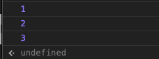

*浏览器相关知识*
<!-- more -->

> setTimeout,setImmediate，Promise,process.nextTick先后顺序问题
>
> 1. JS所谓的单线程是指主线程只有一个，并不是整个运行环境都是单线程
> 2. JS的异步靠底层的多线程实现
> 3. 不同的异步API对应不同的实现线程
> 4. 异步线程与主线程通讯靠的是Event Loop
> 5. 异步线程完成任务后将其放入任务队列
> 6. 主线程不断轮询任务队列，拿出任务执行
> 7. 任务队列有宏任务队列和微任务队列的区别
> 8. 微任务队列的优先级更高，所有微任务处理完成后才会处理宏任务
> 9. Promise是微任务
> 10. Node.js的Event Loop跟浏览器的Event Loop不一样，他是分阶段的
> 11. setImmediate和setTimeout(fn, 0)哪个回调先执行，需要看他们本身在哪个阶段注册的，如果在定时器回调或者I/O回调里面，setImmediate肯定先执行。如果在最外层或者setImmediate回调里面，哪个先执行取决于当时机器情况。
> 12. process.nextTick不在Event Loop的任何阶段，他是一个特殊API，他会立即执行，然后才会继续执行Event Loop

## 浏览器是多进程的

+ 浏览器是多进程的，市场上大多数浏览器使用C#，C，C++写的
+ 浏览器之所以能够运行，是因为系统给它的进程分配了资源（cpu、内存）
+ 简单点理解，每打开一个Tab页，就相当于创建了一个独立的浏览器进程
+ 可以这么理解，浏览器是平台载体，而js是运行在这个平台上的语言

Chrome浏览器打开多个标签页，在 `任务管理器` 中看到有多个进程（一个Tab页面一个独立进程外加一个主程）


## 同步和异步

同步异步简单理解就是，同步的代码都是按照书写顺序执行的，异步的代码可能跟书写顺序不一样，写在后面的可能先执行。

```javascript
const syncFunc = () => {
    const starTime = new Date().getTime();
    while (true) {
        if (new Date().getTime() - starTime > 2000) {
            break;
        }
        console.log(2);
    }
}

console.log(1);
syncFunc();
console.log(3);
```

里面while循环会运行2s，然后打印出2，最后打印出3.所以这里代码的执行顺序跟我们的书写顺序是一致的，他是同步代码:syncFunc,syncFunc上述代码会先打印出1，然后调用环会运行2秒，然后打印出2，最后打印出3.所以这里代码的执行顺序跟我们书写顺序是一致，他是同步代码：



再来看个异步的例子：

```javascript
const asyncFunc = () => {
    setTimeout(() => {
        console.log(2);
    }, 2000);
}

console.log(1);
asyncFunc();
console.log(3);
```

可以看到我们中间调用 `asyncFunc` 里面的2是最后输出的，因为 `setTimeout` 是一个异步方法。他的作用是设置一个定时器，等定时器时间到了再执行回调里面的代码。所以异步相当于做一件事，但是并不是马上做，而是你先给你别人打招呼，说XXX条件满足就干什么。使用异步的好处是你只需要设置好异步的触发条件就可以去干别的事情了，所以异步不会阻塞主干上事件的执行。特别是对JS这种只有一个线程的语言。

### 浏览器的进程

JS是单线程的，单线程如何实现异步？JS单线程是指主运行线程只有一个，而不是整个运行环境都是单线程。JS的运行环境主要是浏览器，以Chrome内核为例，他不仅是多线程，而且是多进程的


Chrome 有这几类的进程和线程，并不是每种只有一个，比如渲染进程就有多个，每个选项卡都有自己的渲染进程。有时候我们使用Chrome会遇到某个选项卡崩溃或者没有响应的情况，这个选项卡对应的渲染进程可能就崩溃了，但是其他选项卡并没有用这个渲染进程，他们有自己的渲染进程，所以其他选项卡并不会受影响。这也是Chrome单个页面崩溃并不会导致浏览器崩溃的原因，不像老IE那样，一个页面卡了整个页面都卡。

前端工程师主要还是关注渲染进程。

`Browser进程` 浏览器的主进程（负责协调、主控），只用一个，作用有

+ 负责浏览器界面显示，用户交互。前进后退
+ 负责各个页面管理，创建销毁其他进程
+ Renderer进程得到内存中的Bltmap，绘制到用户界面
+ 网络资源管理，下载

`第三方插件进程` 每种类型的插件对应一个进程，仅当使用插件时创建

`GPU进程` 最多一个，用于3D绘制等

`浏览器渲染进程` 浏览器内核（Renderer进程，内部是多线程的）：默认每个Tab页面一个进程，互不影响。主要作用有页面渲染，脚本执行，事件处理。

### 浏览器多进程的优势

+ 相对于单进程，多进程的优点，避免单个页面崩溃影响整个浏览器
+ 避免第三方插件崩溃影响整个浏览器
+ 多进程充分利用多核优势
+ 方便使用沙盒模型隔离插件等进程，提高浏览器稳定性

## 渲染进程

渲染进程（多线程）包含的线程（也叫浏览器内核：渲染内核+JS内核+等等）是浏览器内核

### GUI线程

+ 负责渲染浏览器界面，解析HTML，CSS，构建DOM树和RenderObject树，布局和绘制等
+ 当界面需要重绘（Repaint）或由于某种操作引发回流（reflow)时，该线程就会执行

⚠️ 注意: GUI渲染线程与JS引擎线程是互斥的，当JS引擎执行时GUI线程会被挂起（相当于被冻结了），GUI更新会被保存在一个队列中等到JS引擎空闲时立即被执行

### JS引擎线程

+ 这个线程就是负责执行JS的主线程，V8 就是在这个线程中运行的
+ JS引擎一直等待任务队列（事件队列）中的任务到来，然后进行处理，一个Tab页（renderer进程）中无论什么时候都只有一个JS线程在运行JS程序

⚠️ 注意: 这个线程跟GUI线程是互斥的。互斥的原因是JS也可以操作DOM，如果JS线程和GUI线程同时操作  DOM，结果就混乱了，不知道到底渲染哪个结果。这带来的后果就是如果JS长时间运行，GUI线程就不能执行，整个页面就感觉卡死了。所以我们最开始例子的这样长时间的同步代码在真正开发时是绝对不允许的  

### 定时触发器线程

+ 传说中的 `setTimeout` 与 `setInterval` 所在线程，所以"单线程的JS" 能够实现异步。
+ 浏览器定时计数器并不是由Javascript引擎计数的，因为Javascript引擎是单线程，如果处于阻塞线程状态就会影响计时准确
+ 因此通过单独线程来计时并触发定时（计时完毕后，添加到事件队列中，等待JS引擎空闲后执行）
+ 注意，W3C在HTML标准中规定，规定要求setTimeout中低于4ms时间间隔算4ms。所以即便设置setTimeout为0，事实上也是4ms
+ 定时器线程其实只是一个计时作用，并不会执行回调，真正执行回调的还是主线程，所以时间到了后，定时器线程会讲回调事件给到事件触发线程，然后事件触发线程将它添加到事件队列中去。最终JS主线程从事件队列取出这个回调执行。事件触发线程不仅会将定时器事件放入任务队列，其他满足条件的事件也是它负责放进任务队列。

### 事件触发线程

+ 用来控制事件循环（JS引擎忙不过来，需要浏览器另开线程协助）
+ 当JS引擎执行代码块如setTimeout时（也可以是来自浏览器内核的其他线程，如鼠标点击、AJAX异步请求等），会将对应任务添加到事件线程中
+ 当对应的事件符合触发条件被触发时，该线程会把事件添加到待处理队列的队尾，等待JS引擎的处理
+ 注意：由于JS的单线程关系，所以这些待处理队列中的事件都得排队等待JS引擎处理（当JS引擎空闲时才会去执行）

### 异步HTTP请求线程

+ 在XMLHttpRequest在连接后是通过浏览器新开一个线程请求
+ 这个线程负责处理异步的ajax请求，当请求完成后，他也会通知事件触发线程，然后事件触发线程将这个事件放入事件队列给主线程执行
+ 将检测到状态变更时，如果设置有回调函数，异步线程就产生状态变更事件，将这个回调再放入事件队列中。再由Javascript引擎执行。

所以JS异步的实现靠的就是浏览器的多线程，当遇到异步API时，就将这个任务交给对应的线程，当这个异步API满足回调条件时，对应的线程又通过事件触发线程将这个事件放入任务队列，然后主线程从任务队列取出事件继续执行。

### 梳理浏览器内核中线程之间的关系

#### load事件与DOMContentLoaded事件

`DOMContentLoaded` 仅当DOM加载完成，不包括样式表
`load` 页面上所有的DOM，样式表，脚本，图片都已经加载完成了

#### JS阻塞页面加载

JS如果执行时间过长就会阻塞页面。譬如，JS引擎正在进行巨量计算，此时就算GUI更新，也会保存到队列中，等待JS引擎空闲后执行。由于巨量计算，所以JS引擎可能很久才能空闲，自然页面渲染加载阻塞。

#### css加载是否会阻塞dom树渲染

这里说的是头部引入css的情况，由于css是由单独的下载线程异步下载的。

+ css下载不会阻塞DOM树解析（异步加载时DOM照常构建）
+ 但会阻塞render树渲染（渲染时需等css加载完毕，因为render树需要css信息）

加载css会修改下面DOM节点的样式

若css加载不阻塞render树渲染的话，那么当css加载完成后，render树可能又得重新重绘或者回流了，这就造成了一些没有必要的损耗

所以干脆先把DOM树的结构先解析完，把可以做的工作做完，然后等css加载完成后，再根据最终样式渲染render树，这种做法性能会好些。

#### 普通图层和复合图层

+ 普通文档流内可以理解为一个复合图层，absolute（fixed）也都默认是跟普通文档流在同一复合图层中
+ 如果a是一个复合图层，而且b在a上面，那么b也会隐式转为一个复合图层，这点需要特别注意在GPU中，各个复合图层是单独绘制的，所以互不影响
+ 某些动画，为了防止DOM更新然后全部页面回流重绘，所以会通过translate3d等方式，另起一个复合图层，节省性能（硬件加速）

## Event Loop

Event Loop即事件循环，其实是JS管理事件执行的一个流程，具体的管理办法由他具体的运行环境确定。目前JS的主要运行环境有两个

+ [x] 浏览器
+ [x] Node.js

两者之间有所区别

### 浏览器的Event Loop

事件循环就是一个循环，是各个异步线程用来通讯和协同执行的机制。各个线程为了交换消息，还有一个公用的数据区，这就是事件队列。各个异步线程执行完成后，通过事件触发线程将回调事件放到事件队列，主线程每次干完手上的活儿就来看看这个队列有没有新活儿，有的话就取出来执行。


流程：

1. 主线程每次执行时，先看要执行是同步任务还是异步API
2. 同步任务就继续执行，一直执行完
3. 异步API就将它交给对应的异步线程，自己继续执行同步任务
4. 异步线程执行异步API，执行完后，将异步回调事件放入事件队列上
5. 主线程手上的同步任务干完后就来事件队列看看有没有任务
6. 主线程发现事件队列有任务，就取出里面的任务执行
7. 主线程不断循环上述流程

#### 定时器不准

Event Loop 的这个流程里面其实还是隐藏了一些坑的，最典型的问题是总是先执行同步任务，再执行事件队列里的回调。这个特性就直接影响了定时器的执行，我们想想我们开始那个2秒定时器的执行过程：

1. 主线程执行同步代码
2. 遇到`setTimeout`, 将它交给定时器线程
3. 定时器线程开始计时，2秒到了通知事件触发线程
4. 事件触发线程将定时器回调放入事件队列，异步流程到此结束
5. 主线程如果有空，将定时器回调拿出来执行，如果没空这个回调就一直放在队列里

上述流程我们可以看出，如果主线程长时间被阻塞，定时器回调就没机会执行，即使执行了，那时间也不准了，我们将开头那两个例子结合起来看

```javascript
const syncFunc = (startTime) => {
    const time = new Date().getTime();
    while (true) {
        if (new Date().getTime() - time > 5000) {
            break;
        }
    }
    const offset = new Date().getTime() - startTime;
    console.log(`syncFunc run, time offset: ${offset}`);
}

const asyncFunc = (startTime) => {
    setTimeout(() => {
        const offset = new Date().getTime() - startTime;
        console.log(`asyncFunc run, time offset: ${offset}`)
    }, 2000);
}

const startTime = new Date().getTime();
asyncFunc(startTime);
syncFunc(startTime);
```

执行结果如下：


通过结果可以看出，虽然我们先调用asyncFunc，虽然asyncFunc写的是2s后执行，但是syncFunc的执行时间太长，达到5秒，asyncFunc虽然在2s的时候已经进入了事件队列，但是主线程一直在执行同步代码，一直没空，所以也要等到5s后，同步代码执行完毕才有机会执行这个定时器回调。所以再次强调，写代码一定不要长时间占用主线程。

#### 引入微任务

前面的流程图我为了便于理解，简化了事件队列，其实事件队列里面的事件还可以分两类：宏任务和微任务。微任务拥有更高的优先级，当事件循环遍历队列时，先检查微任务队列，如果里面有任务，就全部拿来执行，执行完之后再执行一个宏任务，执行每个宏任务之前都要检查下微任务队列是否有任务，如果有，优先执行微任务队列。所以完整的流程图如下：


上图需要注意以下几点：

1. 一个 `Event Loop` 可以有一个或多个事件队列，但是只有一个微任务队列
2. 微任务队列全部执行完会重新渲染一次
3. 每个宏任务执行完都会重新渲染一次
4. requestAnimationFrame 处于渲染阶段，不在微任务队列，也不在宏任务队列

#### 常见宏任务有

1. script(可以理解为外层同步代码)
2. setTimeout/setInterval、setImmediate
3. I/O、UI事件
4. postMessage、MessageChannel

#### 常见微任务有

1. Promise
2. Object.observe
3. process.nextTick(Node环境)
4. MutationObserver(浏览器)

```javascript
console.log('1');

setTimeout(() => {
    console.log('2');
}, 0);

Promise.resolve().then(() => {
    console.log('5');
});

new Promise((resolve) => {
    console.log('3');
    resolve();
}).then(() => {
    console.log('4');
});

for(let i = 0; i < 10; i++) {
    console.log('这是for里面的输出事件);
}

/*
* 1
* 3
* 这是for里面的输出事件
* 这是for里面的输出事件
* 这是for里面的输出事件
* 这是for里面的输出事件
* 这是for里面的输出事件
* 这是for里面的输出事件
* 这是for里面的输出事件
* 这是for里面的输出事件
* 这是for里面的输出事件
* 这是for里面的输出事件
* 5
* 4
* 2
*/
```

先输出1，这个没什么说的，同步代码最先执行

console.log('2')在setTimeout里面，setTimeout是宏任务，“2”进入宏任务队列

console.log('5')在Promise.then里面，进入微任务队列

console.log('3')在Promise构造函数的参数里面，这其实是同步代码，直接输出

console.log('4')在then里面，他会进入微任务队列，检查事件队列时先执行微任务

同步代码运行结果是“1，3”

然后检查微任务队列，输出“5，4”

最后执行宏任务队列，输出“2”

##### 加强练习

```javascript
async function async1() {
    console.log('async1 start'); // 2
    await async2();
    console.log('async1 end'); // 6
}

async function async2() {
    console.log('async2'); // 3
}

console.log('script start'); // 1

setTimeout(() => {
    console.log('定时器'); // 8
}, 0);

async1()

new Promise(function(resolve) {
    console.log('Promise start'); // 4
    resolve();
}).then(() => {
    console.log('Promise then'); // 7
});

console.log('script end'); // 5

/*
script start
async1 start
async2
Promise start
script end
async1 end
Promise then
定时器
*/

```

### Node.js的Event Loop

Node.js是运行在服务端的js，虽然他也用到V8引擎，但是他的服务目的和环境不同，导致了他API与原生JS有一些区别，他的Event Loop还要处理一些I/O，比如新的网络连接等，所以与浏览器Event Loop也是不一样的。Node的Event Loop是分阶段的。

在Node v10及以前，微任务和宏任务在Node的执行顺序：

1. 执行完一个阶段的所有任务
2. 执行完nextTick队列里面的内容
3. 执行完微任务队列的内容

在Node v10及以前的版本，微任务会在事件循环的各个阶段之间执行，也就是一个阶段执行完毕，就会去执行微任务队列的任务


⚠️注意: 首先需要知道的是Node版本不同，执行顺序有所差异。因为Node v11之后， 事件循环的原理发生了变化，和浏览器执行顺序趋于一致，都是每执行一个宏任务就执行完微任务队列


1. `timers` 执行 `setTimeout` 和 `setInterval` 的回调
2. `pending callbacks` 执行延迟到下一个循环迭代的 I/O 回调
3. `Idle, prepare` 仅系统内部使用
4. `poll` 检索新的 I/O 事件，执行与 I/O 相关的回调。事实上除了其他几个阶段处理的事情，其他几乎所有的异步都在这个阶段处理
5. `check` 在这里执行 `setImmediate`
6. `close callbacks` 一些关闭的回调函数，如： `socket.on('close', ...)`

每个阶段都有一个自己的 `先进先出` 的队列，只有当这个队列的事件执行完或者达到该阶段的上限时，才会进入下一个阶段。

在每次事件循环之间，Node.js都会检查它是否在等待任何一个I/O或者定时器，如果没有的话，程序就关闭退出了。我们的直观感受就是，如果一个Node程序只有同步代码，你在控制台运行完后，他就自己退出了。

还有个需要注意的是poll阶段，他后面并不一定每次都是check阶段，poll队列执行完后，如果没有setImmediate但是有定时器到期，他会绕回去执行定时器阶段：


#### setImmediate和setTimeout

上面的这个流程说简单点就是在一个异步流程里， `setTimeout` 会比定时器先执行

```javascript
console.log('outer');

setTimeout(() => {
    console.log('setTimeout');
}, 0);

setImmediate(() => {
    console.log('setImmediate);
});
```

上述代码运行如下：


和我们前面讲的一样，setImmediate先执行了。我们来理一下这个流程：

1. 外层是一个setTimeout，所以执行他的回调的时候已经在timers阶段了
2. 处理里面的setTimeout，因为本次循环的timers正在执行，所以他的回调其实加到了下个timers阶段
3. 处理里面的setImmediate，将它的回到加入check阶段的队列
4. 外层timers阶段执行完，进入pending callbacks，Idle， prepare， poll，这几个队列都是空的，所以继续往下
5. 到了check阶段，发现了setImmediate的回调，拿出来执行
6. 然后是close callbacks，队列是空的，跳过
7. 又是timers阶段，执行我们的console

但是请注意我们上面console.log('setTimeout')和console.log('setImmediate')都包在了一个setTimeout里面，如果直接写在最外层会怎么样呢？

```javascript
console.log('outer');

setTimeout(() => {
    setTimeout(() => {
        console.log('setTimeout');
    }, 0);
    setImmediate(() => {
        console.log('setImmediate');
    });
});
```

我们看下运行结果：


好像是setTimeout先输出，多运行几次


怎么setImmediate又先出来了，这代码执行的很迷幻，顺着Event Loop整理下

+ node.js里面setTimeout(fn, 0)会被强制改为setTimeout(fn, 1)
+ HTML 5里面setTimeout最小时间限制为4ms

原理都有了，理下流程

1. 外层同步代码一次性全部执行完，遇到异步API就塞到对应的阶段
2. 遇到setTimeout，虽然设置的是0毫秒触发，但是被node.js强制改为1毫秒，塞入times阶段
3. 遇到setImmediate塞入check阶段
4. 同步代码执行完毕，进入Event Loop
5. 先进入times阶段，检查当前时间过去了1毫秒没有，如果过了1毫秒，满足setTimeout条件，执行回调，如果没过1毫秒，跳过
6. 跳过空的阶段，进入check阶段，执行setImmediate回调

通过上述流程的梳理，发现关键就是这1毫秒，如果同步代码执行时间较长，进入Event Loop的时候1毫秒已经过了，setTimeout执行，如果1毫秒还没到，就先执行了setImmediate。每次我们运行脚本时，及其装填可能不一样，导致运行时有1毫秒的差距，一会儿setTimeout先执行，一会儿setImmediate先执行。但是这种情况只会发生在还没有进入timers阶段的时候。若已经在timers阶段，所以setTimeout只能等下一个循环，所以setImmediate肯定先执行。同理的还有其他poll阶段的API也是这样的，比如：

```javascript
const fs = require('fs);

fs.readFile(__filename, () => {
    setTimeout(() => {
        console.log('setTimeout');
    }, 0);
    setImmediate(() => {
        console.log('setImmediate');
    });
});
```

这里setTimeout和setImmediate在readFile的回调里面，由于readFile回调是I/O操作，他本身就在poll阶段，所以他里面的定时器只能进入下一个timers阶段，但是setImmediate却可以在接下来的check阶段运行，所以setImmediate肯定先运行，他运行完后，去检查timers，才会运行setTimeout。

类似的，我们再来看一段代码，如果他们两个不是在最外层，而是在setImmediate的回到里面，其实情况跟外层一样，结果也是随缘的，代码如下：

```javascript
console.log('outer');

setImmediate(() => {
    setTiemout(() => {
        console.log('setTimeout');
    }, 0);
    setImmediate(() => {
        console.log('setImmediate');
    });
});
```

原因跟写在最外层差不多，因为setImmediate已经在check阶段了，里面的循环会从timers阶段开始，会先看setTimeout的回调，如果这时候已经过了1毫秒，就执行他，如果没过就执行setImmediate

#### process.nextTick()

process.nextTick() 是一个特殊的异步API，他不属于任何的Event Loop阶段。事实上Node在遇到这个API时，Event Loop根本就不会继续进行，会马上停下来执行process.nextTick(),这个执行完后才会继续Event Loop。我们写个例子来看下：

```javascript
const fs = require('fs');

fs.readFile(__filename, () => {
    
    setTimeout(() => {
        console.log('setTimeout');
    }, 0);

    setImmediate(() => {
        console.log('setImmediate');

        process.nextTick(() => {
            console.log('nextTick 2');
        });
    });

    console.log('------');
    process.nextTick(() => {
        console.log('nextTick 1');
    });
});
```

这段代码：


流程：

1. 我们代码基本都在readFile回调里面，他执行时，已经在poll阶段
2. 遇到setTimeout(fn, 0), 其实是setTimeout(fn, 1), 死塞入后面的timers阶段
3. 遇到setImmediate，塞入后面的check阶段
4. 遇到nextTick，立马执行，输出'nextTick 1'
5. 到了check阶段，输出'setImmediate', 又遇到个nextTick，立马输出'nextTick 2'
6. 到了下个timers阶段，输出'setTimeout'

这种机制其实类似于我们前面讲的微任务，但是并不完全一样，比如同时有nextTick和Promise的时候，肯定是nextTick先执行，原因是nextTick的队列比Promise队列优先级更高。

```javascript
const promise = Promise.resolve();

setImmediate(() => {
    console.log('setImmediate');
});

promise.then(() => {
    console.log('promise');
});

process.nextTick(() => {
    console.log('nextTick');
});
```

代码运行结果：


### microtask微任务的应用

根据Event loop机制，macrotask的一个任务执行完后就进行UI渲染，然后进行另一个macrotask任务执行，macrotask任务的应用就不做过多介绍。以Vue的异步更新DOM来说明。

Vue异步执行DOM更新，只要观察到数据变化，Vue将开启一个队列，并缓冲在同一事件循环中发生的所有数据变更。

Vue绑定的数据发生变化时，页面视图不会立即重新更新，需要等到当前任务执行完毕时进行更新。

```vue
<tempalte>
    <div>
        <div ref="test">{{test}}</div>
        <button @click="handleClick">test</button>
    </div>
</tempalte>

<script>
export default {
    data() {
        return {
            test: 'begin',
        }
    },
    methods: {
        handleClick() {
            this.test = 'end';
            console.log(this.$refs.test.innerText); // 打印‘begin’
        }
    }
}
</script>
```

上面代码在执行 `this.test = 'end'` 后， 页面视图绑定数据test发生变化，若按照同步执行代码，视图应该能马上获取到对应dom的内容，但是没有获取到。

因为Vue采用异步视图更新。就是说Vue在侦听到数据变化时，异步更新视图最终通过nextTick来完成，该方法采用microtask来实现异步任务。参考[从Vue.js源码看nextTick机制](https://zhuanlan.zhihu.com/p/30451651) 这样在mircotask中就完成数据更新，task结束就可以得到最新的UI了。

```javascript
handleClick() {
    this.test = 'end';
    this.$nextTick(() => {
        console.log(this.$refs.test.innerText); // 打印 'end'
    })
}
```

按照 HTML Standard 描述， macrotask、microtask和UI的渲染执行书怒：

一个macrotask -> 所有microtask -> UI渲染

既然nextTick是按照microtask来实现异步的，那么microtask应该是在UI渲染前执行的，为什么microtask是在UI渲染后执行的。参考[这篇文章](https://zhuanlan.zhihu.com/p/30451651)

深入研究浏览器内核可以发现，浏览器内核是多线程的，其中一个常驻线程叫javascript引擎线程，负责执行js代码，还有一个常驻线程叫GUI渲染线程，负责页面渲染，dom重画等操作。javascript引擎是基于事件驱动单线程执行的，js线程一直在等待着任务列表中的任务到来，而js线程与gui渲染线程是互斥的，当js线程执行时，渲染线程呈挂起状态，只有当js线程空闲时渲染线程才会执行。所以，我们可以理解为什么dom更新总是不能被立刻执行。就我们的代码来说，显示提示和隐藏提示的dom操作都被浏览器记下来了并放在gui渲染线程的任务队列中，但都没有立刻进行渲染，而是在当前函数完成后（js线程已处于空闲状态），进行最终的dom渲染，而我们的用户则基本感受不到这个过程，因为经过show和hide两个相反的操作，相当于dom完全没变。

### microtask微任务跨浏览器实现

从Vue的 `nextTick` 方法的实现以及 [immediate] 的实现可以看出，如何实现Event Loop中的microtask。借助js

+ 原生支持的Promise
+ MutationObserver(浏览器)
+ process.nextTick(nodejs环境)

来实现，都不支持使用setTimeout(fn, 0)来兜底降级实现

+ 浏览器是否原生实现Promise，有则使用Promise实现，否则下一步

    ```javascript
    if (typeof Promise !== 'undefined' && isNative(Promise)) {
        const p = Promise.resolve();    
        microTimerFunc = () => {
            p.then(handle);
        }
    }
    ```

+ 浏览器是否原生支持MutationObserver

```javascript
function microFun(handle) {
    const element = document.createTextNode('');
    const observer = new MutationObserver(handle);
    observer.observe(element, { characterData: true });
    return function() {
        element.data = 'b';
    }
    
}

// MutationObserver接口提供了监视对DOM树所做更改的能力
// 它被设计为旧的Mutation Events功能的替代品，该功能是DOM3 Events规范的一部分
const callback = function (mutationsList, observer) {
    // Use traditional 'for loops' for IE 11
    for (let mutation of mutationsList) {
        if (mutation.type === 'childList') {
            console.log('A child node has been added or removed');
        }
        else if (mutation.type === 'attributes') {
            console.log(`The ${mutation.attributeName} attribute was modified.`)
        }
    }
}

const observer = new MutationObserver(callback); // 创建一个观察器实例并传入回调函数
// 参数1： 选择需要观察变动的节点
// 参数2： 观察器的配置（需要观察什么变动）
observer.observe(document.getElementById('id'), {
    attributes: true,
    childList: true,
    subtree: true,
});
observer.disconnect(); // 之后，可停止观察
```

+ 浏览器是否支持onreadystatechange事件，支持则创建一个空的script标签，一旦插入到document中，其onreadystatechange事件将会异步地触发，比setTimeout(fn, 0)快，否则走下一步

```javascript
function microFun(handle) {
    return function() {
        const scriptEl = document.createElement('script');
        scriptEl.onreadystatechange = function() {
            handle();
            scriptEl.onreadystatechange = null;
            scriptEl.parentNode.removeChild(scriptEl);
            scriptEl = null;
        }
        document.documentElement.appendChild(scriptEl);
        return handle;
    }
}
```

+ 使用setTimeout(fn, 0)来兜底实现

下面看一下core-js模块中Promise中对microtask的模拟实现，具体可参考[源码](https://www.yuque.com/r/goto?url=https%3A%2F%2Fgithub.com%2Fzloirock%2Fcore-js%2Fblob%2Fmaster%2Fpackages%2Fcore-js%2Finternals%2Fmicrotask.js)：

```javascript
module.exports = function() {
    var head, last, notify;
    var flush = function() {
        var parent, fn;
        if (isNode && (parent = process.domain)) parent.exit();
        while (head) {
            fn = head.fn;
            head = head.next;
            try {
                fn();
            } catch (e) {
                if (head) notify();
                else last = undefined;
                throw e;
            }
        }
        last = undefined;
        if (parent) parent.enter();
    }


    // Node.js
    if (isNode) {
        notify = function () {
            process.nextTick(flush);
        }
        // browsers with MutationObserver
    } else if (Observer) {
        var toggle = true;
        var node = document.createTextNode('');
        new Observer(flush).observer(node, {
            characterData: true
        }); // eslint-disable-line no-new
        notify = function () {
            node.data = toggle = !toggle;
        }
        // enviroments with maybe non-completely correct, but existend Promise
    } else if (Promise && Promise.resolve) {
        var promise = Promise.resolve();
        notify = function () {
            promise.then(flush);
        };
        // for other environments - macrotask based on:
        // - setImmediate
        // - MessageChannel
        // - window.postMessage
        // - onreadystatechange
        // - setTimeout
    } else {
        notify = function () {
            // strange IE + webpack dev server bug - use .call(global)
            macrotask.call(global, flush);
        };
    }

    return function (fn) {
        var task = { fn: fn, next: undefined };
        if (last) last.next = task;
        if (!head) {
            head = task;
            notify();
        }
        last = task;
    }
}
```

## 宏任务和微任务相关面试题

### 面试题1

```javascript
async function async1() {
    console.log('async1 start');
    await async2(); // 重点 new Promise(() => {}).then(() => console.log('async end'));
    console.log('async1 end'); // 该任务在then里面
}

async function async2() {
    console.log('async2');
}

console.log('script start');
setTimeout(function() {
    console.log('setTimeout');
}, 0);

async1();

new Promise(function(resolve) {
    console.log('promise');
    resolve();
}).then(function() {
    console.log('promise2');
})
console.log('script end');
/* 
script start
async1 start
async2
promise1
script end
async1 end
promsie2
setTimeout 
*/
```

### 面试题2

```javascript
console.log('start')

setTimeout(() => {
  console.log('children2')
  Promise.resolve().then(() => { // 直接把这个promsie resove出去了,然后把.then微任务的回调放入任务队列里
    console.log('children3')
  })
}, 0)

new Promise(function (resolve) {
  // 宏任务代码
  console.log('children4')
  setTimeout(() => {
    console.log('children5') // 在这个promise里，一定要resolve出去，有结果,.then里的微任务回调才会被添加到任务队列里；所以在第一轮中，.then并没有添加到微任务队列里
    resolve('children6')     // 这一句执行了才是把.then微任务放入队列里
  }, 0);
}).then(res => {   // 微任务代码
  console.log('children7') 
  setTimeout(() => {
    console.log(res)
  }, 0)
})


/* 输出结果
start
children4
children2
children3
children5
children7
children6

第一轮：整体代码宏任务 没有微任务
start => chilren4

执行第二轮宏任务
children2

清空微任务；
chilren3

第三轮宏任务
children5
微任务
children7

第四轮宏任务
children 6
陷阱1： 在promise里，一定要resolve出去，有结果,.then里的微任务回调才会被添加到任务队列里；所以在第一轮中，.then并没有添加到微任务队列里
*/
```

### 面试题3

```javascript
const p = function () {
  return new Promise((resolve, reject) => {
    // 因为p()，所以这里面作为第一轮宏任务开始执行
    const p1 = new Promise((resolve, rejct) => {
      setTimeout(() => { // 陷阱：promise只能resolve一次，状态一旦被改变就不能撤回, 所以这一段不执行
        resolve(1)
      }, 0)
      resolve(2)
    })
    p1.then(res => {
      console.log(res)
    })
    console.log(3)
    resolve(4)
  })
}

p().then(res => {
  console.log(res)
})
console.log('end')

/*
3
end
2
4

第一轮宏任务 3 => end
清空微任务 2 4
陷阱：promise只能resolve一次，状态一旦被改变就不能撤回, 所以setTimeout这一段不执行
*/
```
