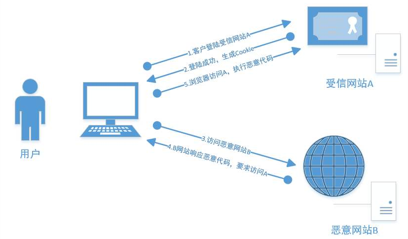
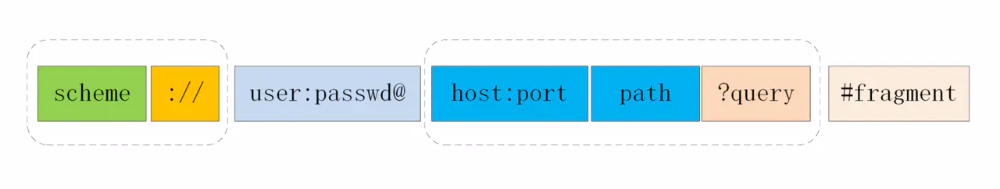
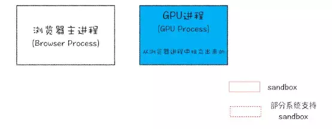
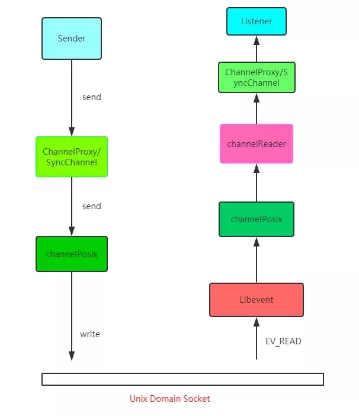
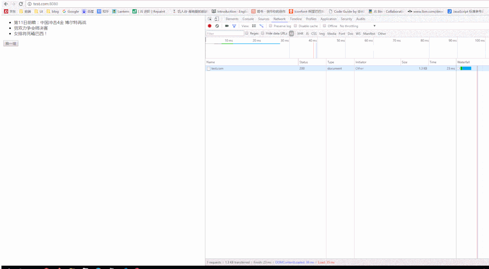
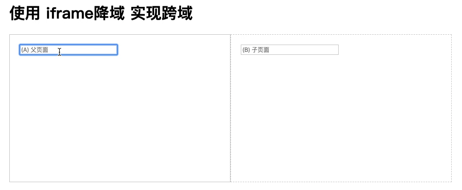
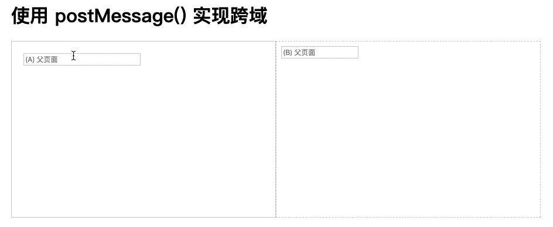
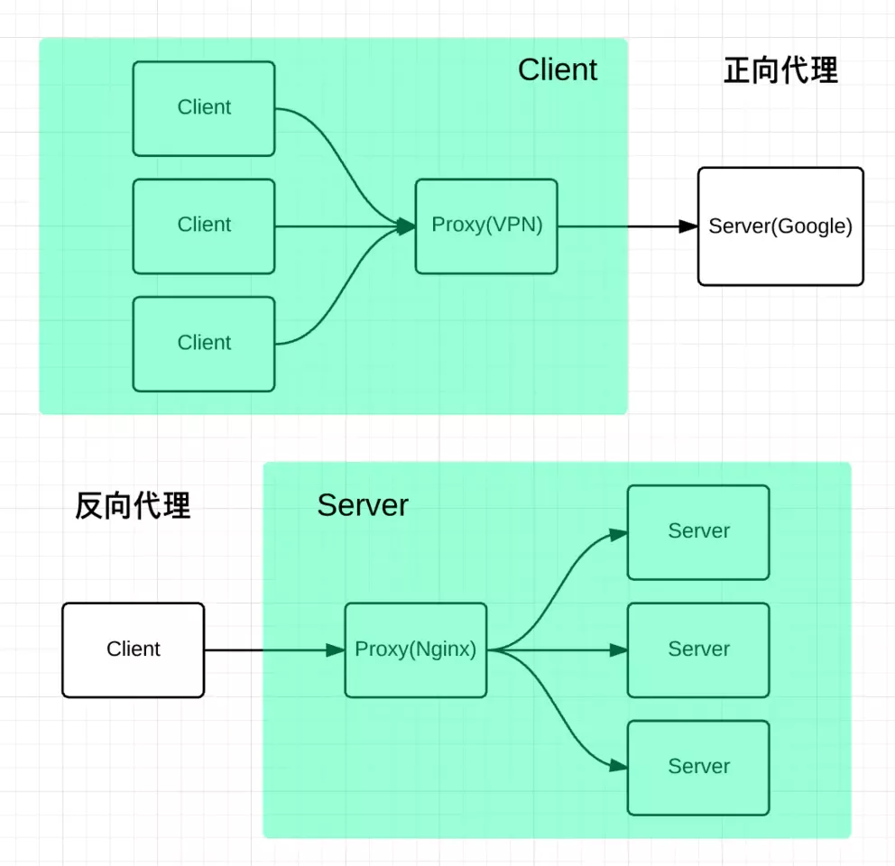

*浏览器相关知识*
<!-- more -->

## 为什么ajax的post请求会先触发options呢？

非简单请求的CORS（跨域）请求，会在正式通信之前，增加一次HTTP查询请求，称为`预测请求（preflight）`。因为你的请求发起域和到达域不在同一个域，所以浏览器会先发起一个options请求来询问到达域，允许那些请求方式、请求头、发起域等。

## 跨域资源共享CORS详解

CORS是一个W3C标准，全称是”跨域资源共享“（Cross-origin-resource-sharing)

它允许浏览器向跨源服务器，发出XMLHttpRequest请求，从而克服AJAX只能同源使用的限制。



### 简介

CORS需要浏览器和服务器同时支持。目前，所有浏览器都支持该功能。IE不能低于10

整个CORS通信过程，都是浏览器自动完成，不需要用户参与。对于开发者而言，CORS通信与同源AJAX通信没有差别，代码完全一样。浏览器一旦发现AJAX请求跨源，就会自动添加头信息，有时会额外附加请求吗，但用户不会有感觉。

因此实现CORS通信关键是服务器。只要服务器实现CORS接口，就可以跨源通信。

### 两种请求

浏览器将CORS请求分为两类：简单请求（simple request）和非简单请求（not-so-simple-request）

同时满足以下两大条件，属于简单请求：

> 1. 请求方法为以下三种之一：
>
>     + HEAD
>     + GET
>     + POST
>
> 2. HTTP的头信息不超出以下几种字段
>
>     + Accept
>     + Accept-Language
>     + Content-Language
>     + Last-Event-ID
>     + Content-Type: 只限于三个值application/x-www-form-urlencoded、multipart/form-data、text/plain

这是为了兼容表单（form），因为历史上表单一直可以发出跨域请求。AJAX的跨域设计就是，只要表单可以发，AJAX就可以直接发。

凡是不同时满足上面两个条件，就属于非简单请求

浏览器对这两种请求的处理，是不一样的

## 简单请求

### 基本流程

对于简单请求，浏览器直接发出CORS请求。具体来说，就是在头信息之中，增加一个Origin字段下面是一个例子，浏览器发现这次跨源AJAX请求是简单请求，就自动在头信息中，添加一个Origin字段。

```javascript
GET /cors HTTP/1.1
Origin: http://api.bob.com
Host: api.alice.com
Accept-Language: en-US
Connection: keep-alive
User-Agent: Mozilla/5.0
```

上面的头信息中，Origin字段用来说明，本次请求来自哪个源（协议+域名+端口）。服务器根据这个值，决定是否同意这次请求。

如果Origin指定的源，不在许可范围内，服务器会返回一个正常的HTTP回应。浏览器发现，这个回应的头信息没有包含Access-Control-Allow-Origin字段，就知道出错了，从而抛出错误，被XMLHttpRequest的onerror捕获。注意这种错误无法通过状态码识别，因为HTTP回应的状态码可能是200.如果Origin指定的域名在许可范围内，服务器返回的响应，会多出几个头信息字段

```javascript
Access-Control-Allow-Origin: http://api.bob.com
Access-Control-Allow-Credentials: true
Access-Control-Expose-Headers: FooBar
Content-Type: text/html; charset=utf-8
```

上面的头信息中，有三个与CORS请求相关的字段，都以Access-Control开头

|||
|---|---|
|Access-Control-Allow-Origin|该字段是必须的它的值要么是请求时Origin字段的值，要么是一个*，表示接受任意域名的请求|
|Access-Control-Allow-Credentials|该字段可选\n它的值是一个布尔值，表示是否允许发送Cookie。默认情况下，Cookie不包括在CORS请求之中。设为true，即表示服务器明确许可，Cookie可以包含在请求中，一起发给服务器。这个值也只能设为true，如果服务器不要浏览器发送Cookie，删除该字段即可|
|Access-Control-Expose-Headers|该字段可选\nCORS请求时，XMLHttpRequest对象的getResponseHeader()方法只能拿到6个基本字段：Cache-Control、Content-Language、Content-Type、Expires、Last-Modified、Pragma。如果想拿到其他字段，就必须在Access-Control-Expose-Headers里面指定。上面的例子指定，getResponseHeader('FooBar')可以返回FooBar字段的值|

### withCredentials 属性

CORS请求默认不发送Cookie和HTTP认证信息。如果要把Cookie发到服务器，一方面要服务器同意，指定Access-Control-Allow-Credentials字段

```javascript
Access-Control-Allow-Credentials: true
```

另一方面，开发者必须在AJAX请求中打开withCredentials属性

```javascript
var xhr = new XMLHttpRequest();
xhr.withCredentials = true;
```

即使服务器同意发送Cookie，浏览器也不会发送。或者，服务器要求设置Cookie，浏览器也不会处理。

但是，如果省略withCredentials设置，有的浏览器还是会一起发送Cookie。这时，可以显式关闭withCredentials

```javascript
xhr.withCredentials = false;
```

需要注意的是，如果要发送Cookie，Access-Control-Allow-Origin就不能设为星号，必须制定明确的、与请求网页一致的域名。Cookie依然遵循同源政策，只有服务器域名设置的Cookie才会上传，其他域名的Cookie并不会上传，且跨源原网页代码中的document.cookie也无法读取服务器域名下的Cookie

### 非简单请求

#### 预检请求

非简单请求是那种对服务器有特殊要求的请求，比如请求方法时PUT或DELETE，或者Content-Type字段类型是application/json

非简单请求的CORS请求，会在正式通信之前，增加一次HTTP查询请求，称为”预检“请求（preflight）

浏览器先询问服务器，当前网页所在域名是否在在服务器的许可名单之中，以及可以使用哪些HTTP动词和头信息字段。只要得到肯定回复，浏览器才会发出正式的XMLHttpRequest请求，否则就报错。

```javascript
var url = 'http://api.alice.com/cors';
var xhr = new XMLHttpRequest();
xhr.open('PUT', url, true);
xhr.setRequestHeader('X-Custom-Header', 'value');
xhr.setRequestHeader('X-Name', 'Ken');
xhr.send();
```

上面代码中HTTP请求使用的方法为PUT，并且发送一个自定义头信息 X-Custom-Header

浏览器发现，这是个非简单请求，就自动发出一个”预检“请求，要求服务器确认可以这样请求。下面是这个”预检“请求的HTTP头信息

```javascript
OPTIONS /cors HTTP/1.1
Origin: http://api.bob.com
Access-Control-Request-Method: PUT
Access-Control-Request-Headers: x-custom-header,x-name
Host: api.alice.com
Accept-Language: en-US
Connection: keep-alive
User-Agent: Mozilla/5.0...
```

"预检"请求用的请求方法是OPTIONS，表示这个请求是用来询问的。头信息里面，关键字段是Origin，表示请求来自哪个源。

除了Origin字段。”预检“请求的头信息包括两个特殊字段。

```javascript
1. Access-Control-Request-Method
该字段是必须的，用来列出浏览器的CORS请求会用到哪些HTTP方法，上例是PUT
2. Access-Control-Request-Headers
该字段是一个逗号分隔的字符串，指定浏览器CORS请求会额外发送的头信息字段，上例是X-Custom-Header,X-Name
```

#### 预检请求回应

服务器收到”预检“请求以后，检查Origin、Access-Control-Request-Method和Access-Control-Request-Headers字段后，允许跨源请求，可以做出回应

```javascript
HTTP/1.1 2000 OK
Date:Mon, 01 Dec 2008 01:15:39 GMT
Server: Apache/2.0.61 (Unix)

Access-Control-Allow-Origin: http://api.bob.com
Access-Control-Allow-Methods: GET, POST, PUT
Access-Control-Allow-Headers: X-Custom-Header

Content-Type: text/html; charset=utf-8
Content-Encoding: gzip
Content-Length: 0
Keep-Alive: timeout=2, max=100
Connection: Keep-Alive
Content-Type: text/plain
```

上面的HTTP回应中，关键的是Access-Control-Allow-Origin字段，表示[http://api.bob.com]可以请求数据。该字段也可以设为星号，表示同意任意跨源请求。

```javascript
Access-Control-Allow-Origin: *
```

如果服务器否定了”预检“请求，会返回一个正常的HTTP回应，但是没有任何CORS相关的头信息字段。这时，浏览器就会认定，服务器不同意预检请求，因此触发了错误，被XMLHttpRequest对象的onerror回调函数捕获。打印信息如下：

```javascript
XMLHttpRequest cannot load http://api.alice.com
Origin http://api.bob.com is 

not allowed by Access-Control-Allow-Origin.
```

服务器回应的其他CORS相关字段如下：

```javascript
Access-Control-Allow-Methods: GET, POST, PUT
Access-Control-Allow-Headers: X-Custom-Header
Access-Control-Allow-Credentials: true
Access-Control-Max-Age: 1728000
```

1. Access-Control-Allow-Methods
    该字段必须，它的值时逗号分隔的一个字符串，表明服务器支持的所有跨域请求方法。注意返回的是所有支持的方法，而不单是浏览器请求的那个方法。这是为了避免多次“预检”请求。
2. Access-Control-Allow-Headers
    如果浏览器请求包括Access-Control-Request-Headers字段，则Access-Control-Allow-Headers字段是必需的。它也是一个逗号分隔的字符串，表明服务器支持的所有头信息字段，不限于浏览器在“预检”中请求的字段。
3. Access-Control-Allow-Credentials
    该字段与简单请求时的含义相同
4. Access-Control-Max-Age
    该字段可选，用来指定本次预检请求的有效期，单位为秒。上面结果中，有效期是20天（1728000秒），即允许缓存该条回应1728000秒（20天），到此期间，不用发出另一条预检请求

#### 浏览器的正常请求和回应

一旦服务器通过了预检请求，以后每次浏览器正常的CORS请求，都跟简单请求一样，会有一个Origin头信息字段。服务器的回应，也都会有一个Access-Control-Allow-Origin头信息字段

下面是“预检”请求之后，浏览器的正常CORS请求

```javascript
PUT /cors HTTP/1.1
Origin: http://api.bob.com
Host: api.alice.com
X-Custom-Header: value
Accept-Language: en-US
Connection: keep-alive
User-Agent: Mozilla/5.0...
```

上面头信息的Origin字段是浏览器自动添加的

下面是服务器正常的回应

```javascript
Access-Control-Allow-Origin: http://api.bob.com
Content-Type: text/html; charset=utf-8
```

上面头信息中，Access-Control-Allow-Origin字段是每次回应必定包含的

#### CORS与JSONP的比较

||jsonp|cors|
|请求类型|只支持GET请求|支持所有类型的HTTP请求|
|兼容性|支持老式浏览器，以及可以向不支持CORS的网站请求数据|只能被大多数现代浏览器支持|
|安全性|可能导致XSS问题|允许站点手动解析响应来确保安全|

## 跨域以及跨域的几种方式

讲解跨域之前我们先来看看什么是同源策略



### 什么是同源策略

通常来说，浏览器处于安全方面的考虑，浏览器遵循同源政策（`scheme（协议）`、`host（主机）`、`port（端口）`都相同则为同源），只允许与本域下的接口交互

不同源的客户端脚本在没有明确授权的情况下，不许读写对方的资源，非同源站点有这样一些限制

+ 不能读取和修改对方的DOM
+ 不读访问对方的Cookie、IndexDB和LocalStorage
+ 限制XMLHttpRequest请求

本域指的是

```javascript
-同协议：比如都是http或者https
-同域名：比如都是http://baidu.com/a和http://baidu.com/b
-同端名：比如都是80端口
```

同源

```javascript
http://baidu.com/a/b.js 和 http://baidu.com/index.php
```

不同源：

```javascript
http://baidu.com/main.js 和 https://baidu.com/a.php（协议不同）
http://baidu.com/main.js 和 http://bbs.baidu.com/a.php(域名不同，域名必须完全相同才可以)
http://baidu.com/main.js 和 http://baidu.com:8080/a.php(端口不同，第一个是80)
```

需要注意的是：对于当前页面来说页面存放js文件的域不重要，重要的是加载该JS的页面所在的域

当浏览器向目标URI发Ajax请求时，只要当前URL和目标URL不同源，则产生跨域，被称为跨域请求

跨域请求的响应一般会被浏览器所拦截，注意，是被浏览器拦截，响应其实是成功到达客户端了。那这个拦截是如何发生呢？

首先要知道，浏览器是多线程的，以Chrome为例，进程组成如下：



*Webkit 渲染引擎*和*V8引擎*都在渲染进程中

当`xhr.send`被调用，即Ajax请求准备发送时，其实还只是渲染进程的处理。为了防止黑客通过脚本触碰到系统资源，浏览器将每一个渲染进程装进了沙箱，并且为了防止CPU芯片一直存在的Spectre和Meltdown漏洞，采取了站点隔离的手段，给每一个不同的站点（一级域名不同）分配了沙箱，互不干扰。

在沙箱当中的渲染进程是没办法发送网络请求的

只能通过网络进程发送。这就涉及到了进程间通信（IPC，Inter Process Communication)了。接下来我们看看chromium当中进程间通信是如何完成的，在chromium源码中调用的顺序如下：



可能看了你会比较懵，如果你想深入了解可以去看看chromium最新源代码，[IPC源码地址](https://www.yuque.com/r/goto?url=https%3A%2F%2Fchromium.googlesource.com%2Fchromium%2Fsrc%2F%2B%2Frefs%2Fheads%2Fmaster%2Fipc%2F) 及 [Chromium IPC 源码解析文章](https://blog.csdn.net/Luoshengyang/article/details/47822689)。

总的来说就是利用 Unix Domain Socket套接字，配合事件驱动的高性能网络并发库 libevent 完成进程的 IPC 过程。

现在数据传递给浏览器主进程，主进程接收到后，才真正地发出相应的网络请求。

在服务端处理完数据后，将响应返回，主进程检查到跨域，且没有cors（后面会详细说）响应头，将响应体全部丢掉，并不会发送给渲染进程。这就达到了拦截数据的目的。

### 跨域方式的演示

介绍跨域方式之前，先修改本机hosts文件

```javascript
127.0.0.1 localhost
127.0.0.1 test.com
127.0.0.1 a.test.com
127.0.0.1 b.test.com
```

这样本地地址就对应了不同的域

### JSONP

html中的script标签可以引入其他域下的js，比如引入线上的jquery库。利用这个特性，可实现跨域访问接口。不过需要后端支持。

JSONP跨域方式是利用 `<script>` 标签的src属性可以跨域引用资源的特点，有些属性的标签还有 ``、`<iframe>`

但是JSONP只支持GET方式，需要后端支持jsonp

web页面中，通过script标签获取js代码可以进行跨域，我们可以动态创建script标签，设置src属性指向我们请求的资源url，放到head标签中。这样就可以把不同域的数据加载到本域名下，不过，需要后端支持jsonp。就是通过前端的url中的callback参数动态生成回调函数名，通过传参的形式执行获取到的数据，前端预定义好的函数就可以让传来的数据自动运行。

#### Node+Javascript 实现JSONP案例

```html
<div class="container">
  <ul class="news">
    <li>第11日前瞻：中国冲击4金 博尔特再战</li>
    <li>男双力争会师决赛 </li>
    <li>女排将死磕巴西！</li>
  </ul>
  <button class="change">换一组</button>
</div>

<!-- 首先，我们在前端要在调用资源的时候动态创建script标签，并设置src属性指向资源的URL地址，代码如下 -->
<script>
  document.querySelector('.change').addEventListener('click', function () {
    var script = document.createElement('script')
    
    //callback=appendHtml是给后端资源打包数据用的参数，同时也是前端定义的回调函数
    script.setAttribute('src', '//a.test.com:8080/getNews?callback=appendHtml')
    
    document.head.appendChild(script)
    document.head.removeChild(script) //删除script标签是因为script标签插入页面的时候资源已经请求到了
  })

  //定义获取资源后需要执行的回调函数
  function appendHtml(news) {
    var html = ''
    for (var i = 0; i < news.length; i++) { html += '<li>' + news[i] + '</li>' }
    document.querySelector('.news').innerHTML = html
  }
</script>
```

后端是把前端发送的URL地址拿到的数据以前端定义的回调函数（appendHtml）的参数的形式返回给前端，这样到前端就可以调用执行了：

```javascript
var http = require("http");

var news = [
  "第11日前瞻：中国冲击4金 博尔特再战200米羽球",
  "正直播柴飚/洪炜出战 男双力争会师决赛",
  "女排将死磕巴西！郎平安排男陪练模仿对方核心",
  "没有中国选手和巨星的110米栏 我们还看吗？",
  "中英上演奥运金牌大战",
  "博彩赔率挺中国夺回第二纽约时报：中国因对手服禁药而丢失的奖牌最多",
  "最“出柜”奥运？同性之爱闪耀里约",
  "下跪拜谢与洪荒之力一样 都是真情流露"
]

var data = [];
for (var i = 0; i < 3; i++) {
  var index = Math.floor(Math.random() * news.length);
  data.push(news[index]);
}

http.createServer(function (request, response) {
  console.log(request.url);
  var callback = request.query.callback;   //查询前端有没有传入回调函数
  if (callback) {
    response.send(callback + '(' + JSON.stringify(data) + ')');    //数据以函数参数的方式传给前端
  } else {
    response.send(data);
  }
}).listen(8888);

console.log("Server running at http://127.0.0.1:8888/");
```



封装XMLHttpRequest

```javascript
function $_ajax(request) {
    request.type = request.type.toUpperCase()
    var send_data =null
    var data_arr = []

    for (var key in request.data) {
        data_arr.push(key + '=' + request.data[key])
    }
    var data_str = data_arr.join('&')

    var xhr = window.XMLHttpRequest ? new XMLHttpRequest() : new ActiveXObject('Microsoft.XMLHTTP')
    if (request.type === 'GET') {
        request.url += '?' + data_str
    }

    if (request.type === 'POST') {
        xhr.setRequestHeader('Content-type', 'application/x-www-form-urlencoded')
        send_data=data_str
    }
  
    xhr.open(request.type, request.url)
    xhr.send(send_data)  //参数的形式是:"key=value&id=123"

    xhr.addEventListener('readystatechange', function () {
    if (this.readyState !== 4) return
        try {
            request.done(JSON.parse(this.responseText))
        } catch (e) {
            request.done(this.responseText)
        }
    })
}

var sayHi = new Function("a", "b", "alert(a + b)")
sayHi("Hello","Word")

$_ajax({
        type: 'get',
        url: 'jsonp.php',
        data: {
        username: "张三",
        password: '123456789'
    },
    done: function (data) {
        console.log(data)
    }
})
$_ajax({
        type: 'Post',
        url: 'jsonp.php',
        data: {
        username: "张三",
        password: '123456789'
    },
    done: function (data) {
        console.log(data)
    }
})
```

### CORS

CORS全称跨域资源共享 (Cross-Origin Resource Sharing)

CORS是一种ajax跨域请求资源的方式

使用XMLHttpRequest发送请求时，浏览器发现请求不符合同源策略，会给该请求加一个请求头 `Origin`

后台进行一系列处理，如果确定接受请求，则在返回结果中加入一个响应头: Access-Control-Allow-Origin

浏览器判断该响应头中是否包含 Origin 的值，如果有则浏览器会处理响应，我们就可以拿到响应数据，如果不包含浏览器直接驳回，这时我们无法拿到响应数据。所以 CORS 的表象是让你觉得它与同源的 ajax 请求没啥区别，代码完全一样

#### CORS相关的HTTP头如下

```javascript
请求头
Origin
Access-Control-Request-Method
Access-Control-Request-Headers
  
  
响应头
Access-Control-Allow-Origin
Access-Control-Allow-Credentials
Access-Control-Expose-Headers
Access-Control-Max-Age
Access-Control-Allow-Methods
Access-Control-Allow-Headers
```

首先js部分，发起Ajax请求（与同域相同）

```javascript
document.querySelector('.change').addEventListener('click', function () {
  var xhr = new XMLHttpRequest();
  xhr.open('get', '//a.test.com:8080/getNews', true);
  xhr.send();
  xhr.onreadystatechange = function () {
    if (xhr.readyState === 4 && xhr.status === 200) {
      appendHtml(JSON.parse(xhr.responseText))
    }
  }
  window.xhr = xhr
})

function appendHtml(news) {
  var html = ''
  for (var i = 0; i < news.length; i++) {
    html += '<li>' + news[i] + '</li>'
  }
  document.querySelector('.news').innerHTML = html
}
```

后端在向前端发送资源前，设置请求头 “Access-Control-Allow-Origin”

```javascript
var news = [
    "第11日前瞻：中国冲击4金 博尔特再战200米羽球",
    "正直播柴飚/洪炜出战 男双力争会师决赛",
    "女排将死磕巴西！郎平安排男陪练模仿对方核心",
    "没有中国选手和巨星的110米栏 我们还看吗？",
    "中英上演奥运金牌大战",
    "博彩赔率挺中国夺回第二纽约时报：中国因对手服禁药而丢失的奖牌最多",
    "最“出柜”奥运？同性之爱闪耀里约",
    "下跪拜谢与洪荒之力一样 都是真情流露"
]
var data = [];
for (var i = 0; i < 3; i++) {
    var index = Math.floor(Math.random() * news.length);
    data.push(news[index]);
}
res.header("Access-Control-Allow-Origin", "//test.com:8080"); // //test.com:8080表示只有//test.com:8080下发起请求才可以调用本域下的资源
//res.header("Access-Control-Allow-Origin", "*");   //*表示任何域下发起请求都可以调用本域下的资源
res.send(data);
```

### iframe 降域

降域是对于iframe元素而言

一般来说域名为 [http://a.test.com/a] A的网页以iframe的形式嵌套一个域名为 [http://b.test.com/b] B的网页中，浏览器发现该请求不符合同源策略，正常情况下不能进行跨域访问

但是当我们在两个页面中分别设置 `document.domain = '相同域名'` 的时候（注意观察这个方法有一个限制就是域名中必有相同部分），A页面就可以访问到B页面的资源了

A页面

```html
<style>
  .ct { width: 910px; margin: auto; }
  .main { float: left; width: 450px; height: 300px; border: 1px solid #ccc; }
  .main input { margin: 20px; width: 200px; }
  .iframe { float: right; }
  iframe { width: 450px; height: 300px; border: 1px dashed #ccc; }
</style>

<div class="ct">
  <h1>使用 iframe降域 实现跨域</h1>
  <div class="main"> <input type="text" placeholder="(A) 父页面"> </div>
  <iframe id="iframe-test" src="http://127.0.0.1:5500/b.html" frameborder="0" scrolling="no"></iframe>
</div>

<script>
  //URL: http://127.0.0.1:5500/a.html
  document.domain = "127.0.0.1"
  document.querySelector('.main input').addEventListener('input', function () {
    console.log(this.value);
    // window.frames["iframe-test"].document.querySelector('input').value = this.value; //❌
    // window.frames[0].document.querySelector('input').value = this.value; //✅
    // document.getElementById("iframe-test").contentDocument.querySelector('input').value = this.value; //✅
    document.getElementById("iframe-test").contentWindow.document.querySelector('input').value = this.value; //✅
  })
</script>
```

B页面

```html
<style>
  html, body { margin: 0; }
  input { margin: 20px; width: 200px; }
</style>
  
<input id="input" type="text" placeholder="(B) 子页面">

<script>
  // URL: http://127.0.0.1:5500/b.html
  document.domain = '127.0.0.1';
  document.querySelector('#input').addEventListener('input', function () {
    window.parent.document.querySelector('input').value = this.value;
  })
</script>
```

通过a.test.com/a.html 访问 b.test.com/b.html，实现了跨域访问，效果如下:



### postMessage()

window.postMessage()是HTML5的新方法，可以使用它来向其它的window对象发送数据，无论这个window对象是属于同源或不同源，IE8+支持

postMessage(data, origin)方法接收两个参数

+ `data` 要传递的数据。html5规范中提到该参数可以是JavaScript的任意基本类型或可复制的对象，然而并不是所有浏览器都做到了这点儿，部分浏览器只能处理字符串参数，所以我们在传递参数的时候需要使用JSON.stringify()方法对对象参数序列化，在低版本IE中引用json2.js可以实现类似效果。
+ `origin` 字符串参数，用来限定接收消息的那个window对象所在的域，如果不想限定域，可以使用通配符 * ，这样可以传递给任意窗口，如果要指定和当前窗口同源的话设置为"/"

同样以上面将域的例子来说明postMessage()的原理（A页面中嵌套了一个B页面）

那么我们可以在A页面中通过postMessage()方法向跨域的B页面传递数据

```html
<style>
  .ct { width: 910px; margin: auto; }
  .main { float: left; width: 450px; height: 300px; border: 1px solid #ccc; }
  .main input { margin: 20px; width: 200px; }
  .iframe { float: right; }
  iframe { width: 450px; height: 300px; border: 1px dashed #ccc; }
</style>


<div class="ct">
  <h1>使用 postMessage() 实现跨域</h1>
  <div class="main">
    <input type="text" placeholder="(A) 父页面">
  </div>
  <iframe src="http://127.0.0.1:5500/b.html" frameborder="0"></iframe>
</div>

<script>
  document.querySelector('.main input').addEventListener('input', function () {
    window.frames[0].postMessage(this.value, '*')
  })
  
  window.addEventListener('message', function (e) {
    document.querySelector('input').value = e.data
  })
</script>
```

那么，我们怎么在B页面上接收A页面传递过来的数据呢，我们只要在B页面监听window的message事件就可以，消息内容储存在该事件对象的data属性中

```html
<input id="input" type="text" placeholder="(B) 父页面">

<script>
  document.querySelector('input').addEventListener('input', function () {
    window.parent.postMessage(this.value, '*')
  })

  window.addEventListener('message', function (e) {
    document.querySelector('input').value = e.data
  })
</script>
```

同样，如果想要在B页面发送数据，A页面接受数据，只要在B页面使用postMessage()方法，然后在A页面监听window的message事件即可。

最终页面得到的效果如下:



### websocket

### nginx 代理

Nginx 是一种高性能的反向代理服务器，可以用来轻松解决跨域问题。

what？反向代理？我给你看一张图你就懂了。



正向代理帮助客户端访问客户端自己访问不到的服务器，然后将结果返回给客户端。

反向代理拿到客户端的请求，将请求转发给其他的服务器，主要的场景是维持服务器集群的负载均衡，换句话说，反向代理帮其它的服务器拿到请求，然后选择一个合适的服务器，将请求转交给它。

因此，两者的区别就很明显了，正向代理服务器是帮客户端做事情，而反向代理服务器是帮其它的服务器做事情。

好了，那 Nginx 是如何来解决跨域的呢？

比如说现在客户端的域名为client.com，服务器的域名为server.com，客户端向服务器发送 Ajax 请求，当然会跨域了，那这个时候让 Nginx 登场了，通过下面这个配置:

```javascript
server {
  listen  80;
  server_name  client.com;
  location /api {
    proxy_pass server.com;
  }
}
```

Nginx 相当于起了一个跳板机，这个跳板机的域名也是client.com，让客户端首先访问 client.com/api，这当然没有跨域，然后 Nginx 服务器作为反向代理，将请求转发给server.com，当响应返回时又将响应给到客户端，这就完成整个跨域请求的过程。

其实还有一些不太常用的方式，大家了解即可，比如 `postMessage`，当然 `WebSocket` 也是一种方式，但是已经不属于 HTTP 的范畴，另外一些奇技淫巧就不建议大家去死记硬背了，一方面从来不用，名字都难得记住，另一方面临时背下来，面试官也不会对你印象加分，因为看得出来是背的。当然没有背并不代表减分，把跨域原理和前面三种主要的跨域方式理解清楚，经得起更深一步的推敲，反而会让别人觉得你是一个靠谱的人。
