*浏览器相关知识*
<!-- more -->

> 编程语言分两类：
>
> + 编译型语言 编译型语言在执行之前要先进行完全编译
> + 解释型语言 解释型语言一边编译一边执行
>
> 很明显解释型语言的执行速度是慢于编译型语言的，JS就是一种解释型脚本语言，支持动态类型、弱类型、基于原型的语言，内置支持类型。鉴于JS都是在前端执行，需要及时响应用户，要求JS可以快速的解析及执行。
>
> 随着Web相关技术的发展，JS承担工作越来越多，需要更快速的解析和执行。V8引擎就是为解决这一问题而生的，在node中采用该引擎来解析JS

## 引擎介绍

+ V8 使用C++开发，运用于谷歌浏览器。在运行JS前，相比其他的JS引擎转换成字节码或解释执行，V8将其编译成原生机器码, 并使用内联缓存等方法来提高性能。 JS程序在V8引擎下的运行速度媲美二进制程序。

+ V8中实现ES中指定ECMA-262

+ V8可以独立运行，可以嵌入任何C++应用程序。基于BSD协议，任何组织或个人可以将其源码用于自己的项目中

## 渲染引擎及网页渲染

### 渲染引擎

Tridend(IE)、Gecko(FF)、WebKit(Safari,Chrome,Android浏览器)等

开发出了基于Webkit的支持HTML5的web操作系统(如：Chrome OS、Web OS)

下面是Webkit的大致结构：

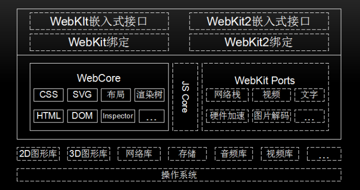

实线框内模块是所有移植的共有部分，虚线框内不同的厂商可以自己实现。

+ `操作系统` 是管理和控制计算机硬件与软件资源的计算机程序，是直接运行在“裸机”上最基本的系统软件，任何其他软件都必须在操作系统的支持下才能进行。Webkit也是在操作系统上工作的。
+ `第三方库` 为了Webkit提供支持，如图形库、网络库、视频库等。
+ `WebCore` 是各个浏览器使用的共享部分，包括HTML解析器、CSS解析器、DOM和SVG等。JavaScriptCore是Webkit的默认引擎，在谷歌系列产品中被替换为V8引擎。Webkit Ports是Webkit中的非共享部分，由于平台差异、第三方库和需求的不同等原因，不同的移植导致了Webkit不同版本行为不一致，它是不同浏览器性能和功能差异的关键部分。
+ `Webkit嵌入式编程接口` 供浏览器调用，与移植密切相关，不同的移植有不同的接口规范
+ `测试用例` 包括布局测试用例和性能测试用例，用来验证渲染结果的正确性

### 网页渲染流程

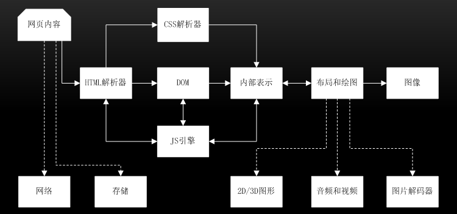

首先是网页内容，输入到HTML解析器，HTML解析器解析，然后构建DOM树，如果遇到JS则交给JS引擎处理，若来自CSS解析的样式信息，构建内部绘图模型。大致分为3个阶段：

### 从输入URL到生成DOM树

1.地址栏输入URL，Webkit调用资源加载器加载相应资源；
2.加载器依赖网络模块建立连接，发送请求并接收答复
3.Webkit接收各种网页或者资源数据，其中某些资源可能同步或异步获取；
4.网页交给HTML解析器转变为词语；
5.解释器根据词语构建节点，形成DOM树；
6.如果节点是JS代码，调用JS引擎解释并执行；
7.JS代码可能会修改DOM树结构；
8.如果节点依赖其他资源，如图片css、视频等，调用资源加载器加载它们，但这些是异步加载的，不会阻碍当前DOM树继续创建；如果是JS资源URL（没有标记异步方式），则需要停止当前DOM树创建，直到JS加载并被JS引擎执行后才继续DOM树的创建

### 从DOM树到构建Webkit绘图上下文

1.CSS文件被CSS解释器解释成内部表示
2.CSS解释器完成工作后，在DOM树上附加样式信息，生成RenderObject树；
3.RenderObject节点在创建的同时，Webkit会根据网页层次结构构建RenderLayer树，同时构建一个虚拟绘图上下文

### 绘图上下文到最终图像呈现

1.绘图上下文是一个与平台无关的抽象类，它将每个绘图操作桥接到不同的具体实现类，也就是绘图具体实现类；
2.绘图实现类也可能有简单的实现，也可能有复杂的实现，软件渲染、硬件渲染、合成渲染等；
3.绘图实现类将2D图形库或者3D图形库绘制结果保存，交给浏览器界面进行展示。

上述是一个完整的渲染过程，现代网页很多都是动态的，随着网页与用户的交互，浏览器需要不断的重复渲染流程。

### JS引擎

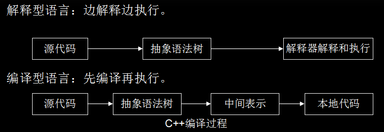

JS本质上是一种解释型语言，与编译型语言不同的是它需要一边执行一边解析，编译型语言在执行时已经完成编译，可直接执行，有更快的执行速度。JS代码是在浏览器解析和执行的，若时间太长，会影响用户体验。那么提高JS的解析速度就是当务之急。JS引擎和渲染引擎关系如图：

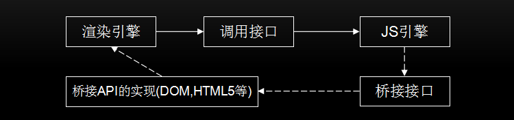

JS语言是解释型语言，为了提高性能，引入了Java虚拟机和C++编译器中的众多技术。现在JS引擎的执行过程大致是：

`源代码`->`抽象语法树（AST）`->`字节码`->`JIT`->`本地代码`

```javascript
function demo(name) {
  console.log(name);
}
```

抽象语法树如下：

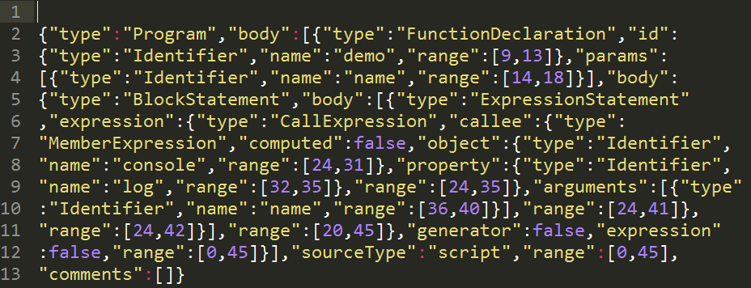

V8更直接的将抽象语法树通过JIT技术转换成本地代码，放弃了字节码阶段可以进行的性能优化，但保证了执行速度。在V8生成本地代码后，通过Profiler采集信息，优化本地代码。少了生成字节码这一阶段的性能优化，极大减少了转换时间。

新增了一个Ignition字节码解释器，将默认启动，从此之后将与JSCore有大致相同的流程。做出这一改变的原因：减轻机器码占用的内存空间，即牺牲时间换空间；提高代码的启动速度；对v8的代码进行重构，降低v8的代码的复杂度

JS的性能和C相比还有不小的距离，可预见的未来估计也只能接近它，从语言类型上已经决定了。

## V8引擎

V8引擎是一个JS引擎实现，最初由一些语言方面专家设计，后别谷歌收购，谷歌对其进行了开源。V8使用C++开发，在运行JS前，相比其他的JS引擎转换成字节码或解释执行，V8将其编译成原生机器码，并且使用了如内联缓存等方法来提高性能。

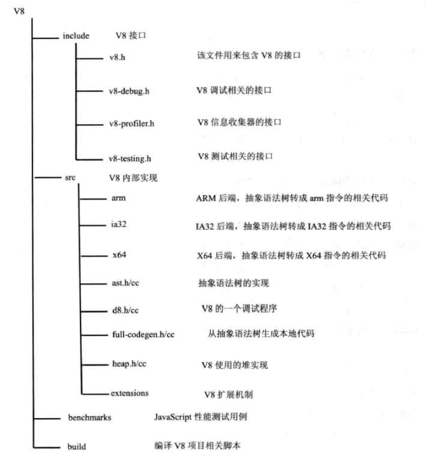

### 数据表示

JS是一种动态类型语言，在编译时不能准确知道变量的类型，只可以在运行时确定，这不就像c++或者java等静态类型语言，在编译时候就可以确切知道变量的类型。运行时计算和决定类型，会严重影响语言性能，这就是JS运行效率比C++或者Java低很多的原因之一

在C++中，源码要经过编译才能执行，生成本地代码过程，变量的地址和类型已确定，运行本地代码时利用数组和位移就可以存取变量和方法的地址，不需要再进行额外的查找，几个机器指令即可完成，节省了确定类型和地址的时间。由于JS是无类型语言，那就不能像C++那样执行时已经知道变量的类型和地址，需要临时确定。JS和C++区别

+ `偏移位置确定` C++编译阶段确定位置偏移信息，在执行时直接存取，JS在执行阶段确定，执行期间可以修改对象属性；
+ `偏移信息共享` C++有类型定义，执行时不能动态改变，可共享偏移信息，JS每个对象都是字描述，属性和位置偏移信息都包含在自身结构中
+ `偏移信息查找` C++查找偏移地址很简单，在编译代码阶段，对使用某类型成员变量直接设置偏移位置

JS中使用一个对象，需要通过属性名匹配才能找到相应的值，需要更多操作。在代码执行过程中，变量的存取是非常普遍和频繁的，通过偏移量来存取，使用少数两个汇编指令就能完成，如果通过属性名匹配则需要更多的汇编指令，也需要更多的内存空间。

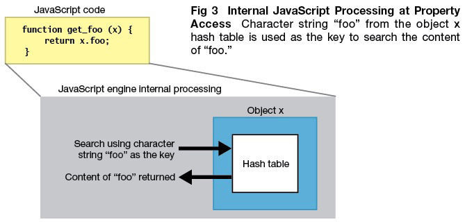

在javascript中，除boolean，number，string，null，undefined这五个简单变量外，其他数据都是对象，V8使用一种特殊的方式来表示它们，进而优化JS的内部表示问题。

在V8中，数据的内容表示由数据的实际内容和数据的句柄构成。

+ 数据的实际内容是会变长的，类型也是不同的；
+ 句柄固定大小，包含指向数据的指针

这种设计可以方便V8进行垃圾回收和移动数据内容，直接使用指针的话就会出问题或者需要更大的开销，使用`句柄`的话，只需修改句柄中的指针即可，使用者使用的还是句柄，指针改动是对使用者透明。

除少数数据由handle本身存储外，其他内容限于句柄大小和变长等原因，都存储在堆中。

整数直接从value中取值，然后使用一个指针指向它，可以减少内存的占用并提高访问速度。

一个句柄对象的大小是4字节（32位设备）或者8字节（64位设备）

在JavaScriptCore中，使用8个字节表示句柄。

在堆中存放的对象都是4字节对齐的，所以它们指针的后两位是不需要的，V8用这两位数表示数据的类型：

+ 00为整数
+ 01为其他

JS对象在V8中实现包含三个部分：

`隐藏类指针` 为JS对象创建隐藏类
`元素表指针` 指向该对象包含的属性
`属性值表指针` 指向该对象包含的属性值

### 工作过程

前面有介绍，V8引擎在执行JS过程中，主要有两个阶段：

+ 编译
+ 运行

与C++执行前完全编译不同的是，JS需要在用户使用时完成编译和执行。在V8中，JS相关代码并非一下完成编译的，在某些代码需要执行时，才会进行编译，提高了响应时间，减少了时间开销。在V8引擎中，源代码先被解析器变为抽象语法树（AST),然后使用JIT编译器的全代码生成器从AST直接生成本地可执行代码。这个过程不同于JAVA先生成字节码或中间表示，减少了AST到字节码的转换时间，提高了代码的执行速度。由于缺少了优化代码的机会。

V8引擎编译本地代码时，使用主要类如下：

+ `Script` 表示JS代码，即包含源代码，包含编译后生成的本地代码，即编译入口，又是运行入口；

+ `Compiler` 编译器类，辅助Script类来编译生成代码，调用解释器（Parser）来生成AST和全代码生成器，将AST转变为本地代码；

+ `AstNode` 抽象语法树接节点类，是其他所有节点的基类，包含非常多的子类，后面会针对不同的子类生成不同的本地代码；

+ `AstVisitor` 抽象语法树的访问者类，主要用来遍历异构的抽象语法树；

+ `FullCodeGenerator` AstVisitor类的子类，通过遍历AST来为JS生成本地可执行代码

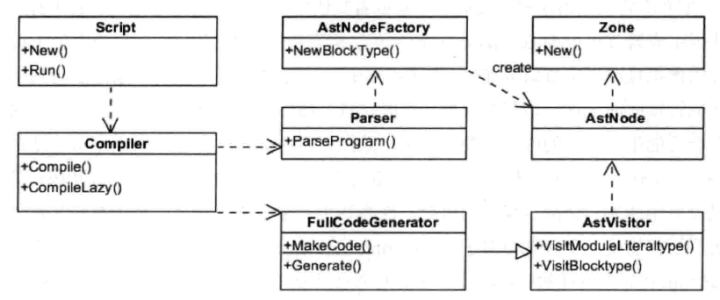

JS代码编译过程大致为：

+ Script类调用Compiler类的Compile函数为其生成本地代码
+ Compile函数先使用Parser类生成AST，再使用FullCodeGenerator类生成本地代码
+ 本地代码与具体的硬件平台密切相关，FullCodeGenerator使用多个后端来生成与平台相匹配的本地汇编代码
+ 由于FullCodeGenerator通过遍历AST来为每个节点生成相应的汇编代码，缺失了全局视图，节点间的优化也就无从谈起

在执行编译之前，V8会构建全局对象并加载一些内置的库，来构建一个运行环境。在JS源码中，并非所有函数都被编译成了本地代码，而是延迟编译，在调用时才会编译。

由于V8缺少了生成中间代码这一环节，缺少了必要的优化，为了提升性能，V8会在生成本地代码后，使用数据分析器采集一些信息，根据这些数据将本地代码进行优化，生成更高效的本地代码，这是个逐步改进的过程。当发现优化后代码的性能不如未优化的代码，V8将退回原来的代码，也就是优化回滚。下面介绍一下运行阶段，该阶段主要类如下所示：

+ `Script` 表示JS代码，即包含源代码，包含编译之后生成的本地代码，即是编译入口，又是运行入口；
+ `Execution` 运行代码的辅助类，包含一些重要函数，如Call函数，它辅助进入和执行Script代码；
+ `JSFunction` 需要执行JS函数表示类
+ `Runtime` 运行这些本地代码的辅助类，主要提供运行时所需的辅助数组，如：属性访问、类型转换、编译、算数、位操作、比较、正则表达式等；
+ `Heap` 运行本地代码需要使用的内存堆类；
+ `MarkCompactCollector` 垃圾回收机制的主要实现类，用来标记、清除和整理等基本的垃圾回收过程；
+ `SweeperThread` 负责垃圾回收的线程

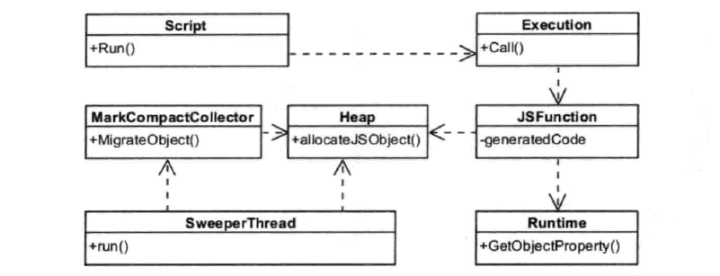

先根据需要编译和生成这些本地代码，也就是使用编译阶段那些类和操作。V8中，函数是个基本单位，当某个JS函数被调用时，V8会查找函数是否已经生成本地代码，若已生成，则直接调用该函数。否则，V8引擎会生成属于该函数的本地代码。执行编译后的代码为JS构建JS对象，这需要Runtime类来辅助创建对象，并需要从Heap类分配内存。借助Runtime类中辅助函数来完成一些功能，如属性访问等。最后将不用的空间进行标记回收。

### 优化回滚

V8是基于AST直接生成本地代码，没有经过中间表示层的优化，所以本地代码尚未经过很好的优化。在2010年，V8引入了新的编译器-Crankshaft，主要针对热点函数优化，基于JS源代码开始而非本地代码，同时构建Hydroger图并基于此进行优化分析

Crankshaft编译器为了性能考虑，通常会做出较乐观和大胆预测——代码稳定且变量类型不变，可以生成高效本地代码。但是鉴于JS是弱类型语言，变量类型在执行过程中随时会改变，鉴于此种情况，V8将该编译器做的想当然的优化进行回滚，称优化回滚

```javascript
var counter = 0;
function test(x, y) {
  counter++;
  if (counter < 1000000) {
    // do something
    return 'jeri';
  }
  var unknown = new Date();
  console.log(unknown);
}
```

该函数被调用多次后，V8引擎可能会触发Crankshaft编译器对其优化，优化代码认为示例的类型信息都已被确定。但由于尚未真正执行new Date(),并未获取unknown的变量类型，V8只得将该部分代码进行回滚。优化回滚是一个很耗时的操作，在写代码过程中，尽量不要触发优化该操作。

新增了一个Ignition字节码解释器，让新的Turbofan直接从字节码来优化代码，并当需要进行反优化的时候直接反优化到字节码，不要再考虑JS源代码

### 隐藏类

在执行C++代码时，仅凭几个指令可以根据偏移信息获取变量信息

JS里需要通过字符串匹配来查找属性值，这就需要更多的操作才能访问到变量信息，而代码量变量存取是十分频繁的，这也制约了Javascript的性能

V8借用了类和偏移位置的思想，将本来通过属性名匹配来访问属性值的方法来进行改进，使用类似C++编译器的偏移位置机制来实现，这就是隐藏类。

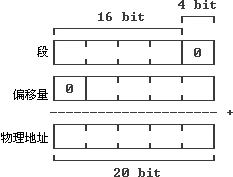

+ 段地址左移四位，与有效地址相加，就构成逻辑地址。一般而言，段地址是cpu自己独立编制的，但是偏移量是程序员编写的。偏移量就是程序的逻辑地址与段首的差值。

+ 在早期的8086中地址线是20位的，而段地址是16位。在十六进制下就是4位。这样一个段寄存器就不能完整的描述出内存的地址。所以就和通用寄存器配用。偏移量存在通用寄存器中，段地址则存在段寄存器中。而地址首的五位（十六进制下，二十地址线是五位）有个特点，即末尾总是零，所以就取前四位当做段地址。正好是段地址的存储空间大小。所以在上图中，按照地址存储时的分法，倒过来组合，即左移四位（二进制下，十六进制是一位），比如段地址为1001H（H十六进制之意），左移一位（乘以16），即补零变为10010H，假设偏移地址是1010H，则实际物理地址就是11020H了。形象来说，段地址是头，偏移量是实际位置相对头的位置。

隐藏类将对象划分成不同的组，对于组内对象拥有相同的属性名和属性值的情况，将这些组的属性名和对应的偏移位置保存在一个隐藏类中，组内所有对象共享该信息。同时，也可识别属性不同的对象。

### 内嵌缓存

正常访问对象属性的过程：

+ 首先获取隐藏类的地址
+ 然后根据属性名查找偏移值，然后计算该属性的地址

虽然相比以往在整个执行环境中查找减小了很大的工作量，但依然比较耗时。

能不能将之前查询的结果缓存起来，供再次访问呢？这就是内嵌缓存。

内嵌缓存的思路就是将初次查找的隐藏类和偏移值保存起来，当下次查找的时候，先比较当前对象是否是之前的隐藏类，若是的话，直接使用之前的缓存结果，减少再次查找表的时间。若一个对象有多个属性，那缓存失误的概率就会提高，因某属性的类型变化后，对象的隐藏类也会变化，与之前缓存就不一致，需要重新使用之前的方式重新查找缓存表。

### 内存管理

Node中通过JS使用内存时就会发现只能使用部分内存（64位系统约1.4GB，32位系统约为0.7GB），深层原因是V8进行垃圾回收时，需要耗费更多的资源和时间，严重影响JS的执行效率）。下面对内存管理进行介绍

内存管理组要由分配和回收两个部分构成。V8内存划分如下：

`Zone` 管理小块内存。首先自己申请一块内存，然后管理和分配一些小内存，当一块小内存被分配之后，不能被Zone回收，只能一次性回收Zone分配的所有小内存。当一个过程需要很多内存，Zone将需要分配大量的内存，却又不能及时回收，会导致内存不足的情况。

`堆` 管理JS使用的数据、生成的代码、哈希表等。为方便实现垃圾回收，堆被分为三个部分：

+ `年轻分代` 为新创建的对象分配内存空间，经常需要进行垃圾回收。为方便年轻分代中的内容回收，可再将年轻分代分为两半，一半用来分配，另一半在回收时负责将之前还需要保留的对象复制过来。

+ `年老分代` 根据需要将年老的对象、指针、代码等数据保存起来，较少地进行垃圾回收。

+ `大对象` 为那些需要使用较多内存对象分配内存，当然同样可能包含数据和代码等分配的内存，一个页面只分配一个对象。

### 垃圾回收

V8使用了分代和大数据的内存分配，在回收内存时使用精简整理的算法标记未引用的对象，消除没有标记的对象，最后整理和压缩哪些未保存的对象，即可完成垃圾回收。

在V8中，使用较多的是年轻分代和年老分代。年轻分代中对象垃圾回收主要通过Scavenge算法进行垃圾回收。在Scavenge的具体实现中，主要采用了 `Cheney算法` 通过复制的方式实现的垃圾回收算法。它将堆内存分为两个semispace。

+ 一个处于使用中（From空间）
+ 另一个处于闲置状态（To空间）

当分配对象时，先是在From空间中进行分配。当开始进行垃圾回收时，会检查From空间中的存活对象，这些存活对象将被复制到To空间中，而非存活对象占用的空间将会被释放。完成复制后，From空间和To空间的角色发生对换。在垃圾回收过程中，通过将存活对象在两个semispace空间之间进行复制。年轻分代中的对象有机会晋升为年老分代，条件主要有两个：

+ 一个是对象是否经历过Scavenge回收
+ 一个是To空间的内存占用比超过限制

对于年老分代中的对象，由于存活对象占比较大比重，再采用上面的方式会有两个问题：

+ 一个是存活对象较多，复制存活对象的效率将会很低；
+ 另一个问题依然是浪费一半空间的问题。

当分配对象时，先是在From空间中进行分配。进行垃圾回收时，会检查From空间中存活对象，这些存活对象将被复制到To空间中，而非存活对象占用的空间将被释放。复制后，From空间和To空间的角色发生对换。在垃圾回收过程中，通过将存活对象在两个semispace空间之间进行复制。年轻分代中的对象有机会晋升为年老分代，条件主要有两个：

+ 一个是对象是否经历过Scavenge回收
+ 一个是To空间的内存占用比超过限制

对于年老分代中的对象，由于存活对象占较大比重，再采用上面的方式会有两个问题：

+ 一个是存活的对象较多，复制存活对象的效率将会很低；
+ 另一个问题依然是浪费一半空间的问题。

V8在年老分代中主要采用下面两种相结合的方式进行垃圾回收

+ `Mark-Sweep(标记清除)`
+ `Mark-Compact(标记整理)`

[V8引擎如何进行垃圾内存回收](https://www.yuque.com/kenguba/upkpls/uld49q#sy4MA)

### 快照

在V8引擎启动时，需要构建JS运行环境，需要加载很多内置对象，也需要建立内置的函数，如Array，String，Math等。为了使V8更整洁，加载对象和建立函数等任务都是使用JS文件来实现的，V8引擎负责提供机制来支持，在编译和执行JS前先加载这些文件

V8引擎需要编译和执行这些内置的JS代码，同时使用堆等来保存执行过程中创建的对象、代码等，这些都需要时间。

V8引入了快照机制，将这些内置的对象和函数加载之后的内存保存并序列化。序列化后的结果是很容易反序列化，经过快照启动时间可以缩减几毫秒。

快照机制也可以将一些开发者认为需要的JS文件序列化，减少处理时间。不过快照机制的加载的代码不能被CrankShaft这样的编译器优化，可能会存在性能问题。

## V8 VS JavaScriptCore

JavaScriptScore引擎是Webkit中默认的JS引擎，是苹果开源的一个项目，应为较为广泛。2008年通过重新实现编译器和字节码解释器，使引擎性能较大提升。随后

+ 内嵌缓存
+ 基于正则表达式
+ 简单JIT
+ 字节码解释器

等技术引入进来，JavaScriptCore引擎也在不断迭代和发展。

V8引擎自诞生来就以性能优化作为目标，引入众多新技术，带动了整个业界JS引擎性能的快速发展。总的来说

+ V8引擎较为激进，青睐可以提高性能的新技术
+ JavaScriptCore引擎较为稳健，渐进式的改变着自己的性能

总的来说，JS引擎工作流程（包含v8和JavaScriptCore)如下：

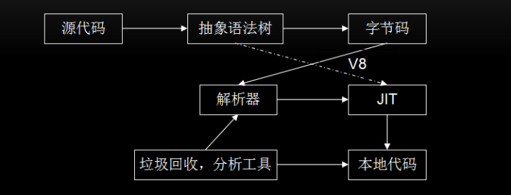

JavaScriptCore的大致流程：

`源代码` -> `抽象语法树` -> `字节码` -> `JIT` -> `本地代码`

JavaScriptCore与V8有一些不同之处，最大的不同就是新增了 字节码的中间表示，并加入了多层JIT编译器（如： 简单JIT编译器，DFG JIT编译器、LLVM等）优化性能，不停的对本地代码进行优化。

在V8的5.9版本中，新增一个Ignition字节码解释器，TurboFan和Ignition结合起来共同完成JS的编译，V8将与JavaScriptCore有大致相同的流程，Node 8.0中V8版本为5.8

还有就是数据表示方面，V8在不同机器上使用与机器位数相匹配的数据表示，JavaScriptCore中句柄都是使用64位表示，其可以表示更大范围的数字，所以即使在32位的机器上，浮点类型同样可以保存在句柄中，不再需要访问堆中的数据，当也会占用更多的空间。

## 功能扩展

JS引擎的主要功能是解析和执行JS代码，往往不能满足使用者多样化的需要，那么就可以增加扩展以提升它的能力。V8引擎有两种扩展机制：绑定和扩展

### 绑定机制

使用IDL文件或接口文件生成绑定文件，将这些文件同V8引擎一起编译。Webkit中使用IDL来定义Javascript，但又与IDL有所不同，有一些改变。定义一个新的接口的步骤大致如下：

+ 1. 定义新的接口文件，可以在JS代码进行调用，如mymodule.MyObj.myAttr；

  ```C++
  module mymodule {
    interface [
      InterfaceName = MyObject
    ] MyObj {
      readonly attribute long myAttr;
      DOMString myMethod (DOMString myArg);
    }
  }
  ```

+ 2. 按照引擎定义的标准接口为基础实现接口类，生成JS引擎所需的绑定文件。Webkit提供工具帮助生成所需的绑定类，根据引擎不同和引擎开发语言的不同而有所差异。V8引擎会为上述代码生成V8MyObj.h(MyObj类具体的实现代码)和V8MyObj.cpp（桥接代码，辅助注册桥接的函数到V8引擎）两个绑定文件。

JS引擎绑定机制需要将扩展代码和JS引擎一块编译和打包，不能根据需要在引擎启动后再动态注入这些本地代码。实际Web开发中，开发者都是基于现在浏览器的，根本不可能介入到JS引擎编译中，绑定机制有很大局限性，但非常高效，适用于对性能要求较高的场景。

## Extension机制

通过V8的基类Extension进行能力扩展，无需和V8引擎一起编译，可以动态为引擎增加功能特性，具有很大的灵活性。

Extension机制的大致思路就是，V8提供一个基类Extension和一个全局注册函数，要想扩展JS能力，需要经过以下步骤：

```C++
class MYExtension : public v8::Extension {
    public:
        MYExtension() : v8::Extension("v8/My", "native function my();") {}
        virtual v8::Handle<v8::FunctionTemplate> GetNativeFunction (
        v8::Handle<v8::String> name) {
            // 可以根据name来返回不同的函数
            return v8::FunctionTemplate::New(MYExtention::MY);
        }
        static v8::Handle<v8::Value> MY(const v8::Arguments& args) {
            // Do sth here
            return v8::Undefined();
        }
};
MYExtension extension;
RegisterExtension(&extension);
```

+ 基于Extension基类构建一个它的子类，并实现它的虚函数—GetNativeFunction，根据参数name来决定返回实函数；
+ 创建一个该子类的对象，并通过注册函数将该对象注册到V8引擎，当JavaScript调用’my’函数时就可被调用到

⚠️ 提示: Extension机制是调用V8的接口注入新函数，动态扩展非常方便，但没有绑定机制高效，适用于对性能要求不高的场景

## 总结

在过去几年，JavaScript在很多领域得到了广泛的应用，然而限于JavaScript语言本身的不足，执行效率不高。Google也推出了一些JavaScript网络应用，如Gmail、Google Maps及Google Docs office等。这些应用的性能不仅受到服务器、网络、渲染引擎以及其他诸多因素的影响，同时也受到JavaScript本身执行速度的影响。然而既有的JavaScript引擎无法满足新的需求，而性能不佳一直是网络应用开发者最关心的。Google就开始了V8引擎的研究，将一系列新技术引入JavaScript引擎中，大大提高了JavaScript的执行效率。相信随着V8引擎的不断发展，JavaScript也会有更广泛的应用场景，前端工程师也会有更好的未来！

那么结合上面对于V8引擎的介绍，我们在编程中应注意：

+ `类型` 对于函数，JavaScript是一种动态类型语言，JavaScriptCore和V8都使用隐藏类和内嵌缓存来提高性能，为了保证缓存命中率，一个函数应该使用较少的数据类型；对于数组，应尽量存放相同类型的数据，这样就可以通过偏移位置来访问。
+ `数据表示` 简单类型数据（如整型）直接保存在句柄中，可以减少寻址时间和内存占用，如果可以使用整数表示的，尽量不要用浮点类型。
+ `内存` 虽然JavaScript语言会自己进行垃圾回收，但我们也应尽量做到及时回收不用的内存，对不再使用的对象设置为null或使用delete方法来删除(使用delete方法删除会触发隐藏类新建，需要更多的额外操作)。
+ `优化回滚` 在执行多次之后，不要出现修改对象类型的语句，尽量不要触发优化回滚，否则会大幅度降低代码的性能。
+ `新机制` 使用JavaScript引擎或者渲染引擎提供的新机制和新接口提高性能。
